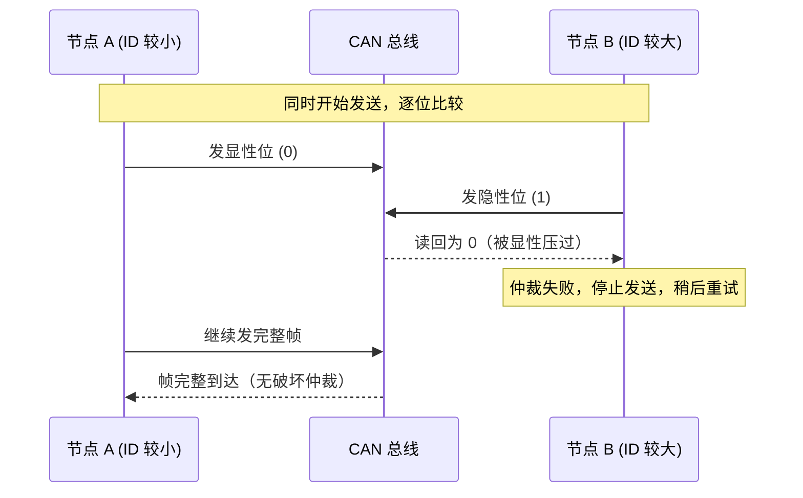
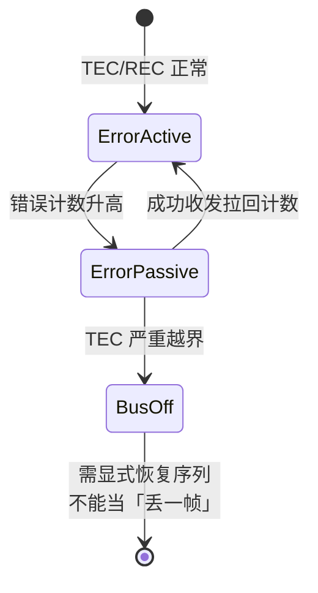
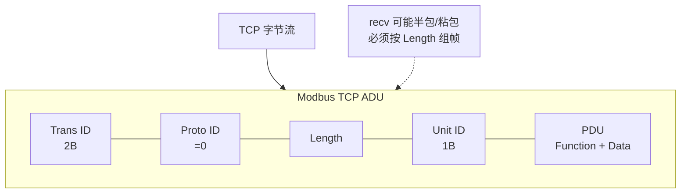
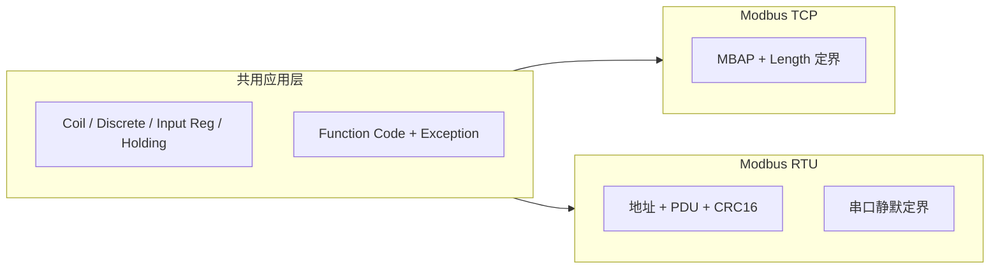

# C/C++、Linux Runtime 与面试知识库

状态：Living document  
适用对象：大致了解 C/C++ 和操作系统概念、但尚不能完整解释 Linux Runtime 调用链的开发者。

这份文档不是语法大全，也不要求先学完再写代码。推荐方法是：先读直觉模型，再在本仓
找到对应代码，运行观察实验，最后尝试不用术语堆砌地口述面试答案。

## 1. 怎样使用这份知识库

每个主题按三种证据等级标记自己：

| 等级 | 含义 | 面试时可以怎样说 |
|---|---|---|
| 理解过 | 能解释概念和主要取舍，但没有亲手实现 | “我理解其机制和适用边界，但本项目尚未使用” |
| 使用过 | 代码中实际使用，且单元/集成测试通过 | “我在该调用链中使用，并用这些测试验证” |
| 测量过 | 在明确平台、负载和配置下保存了可复现数据 | “在这个内核和负载条件下测得……，不推广到其他平台” |

面试前不要只背结论。对每个主题练习回答五句话：问题是什么、方案是什么、内核做什么、
失败怎样表现、证据在哪里。

## 2. 一分钟项目说明

可以先用下面这段结构组织自己的语言：

> 这个项目的目标是部署一个 Orange Pi 上的 ROS-free Linux 边缘 Runtime。它不做电机 PID，
> 而是练习周期监督、SocketCAN fd 事件循环、状态机、watchdog、trace 和 systemd 部署。
> 当前已经完成 Linux Core、CAN V1 无状态 codec 与独立节点模拟器：使用
> `CLOCK_MONOTONIC` 和绝对时间睡眠，申请 `SCHED_FIFO` 失败时能显式降级；普通输出通过带
> session、sequence 和 deadline 的 latest-wins mailbox；线级 8-byte 消息经显式大端编解码；
> `rcr_node_sim` 以单线程 epoll 在 vcan 上发 heartbeat/收命令；`rcr_vcan_acceptance`
> 用第二进程做六场景闭环；`rcrd` 已组合周期监督、CAN I/O、有界事件队列和有界退出。
> 部署侧已完成 release/current 合同（P3-A0）、systemd unit 静态资产（P3-A1）与到货前
> bring-up 勾选表/共享矩阵 runner（P3-A2）；Orange Pi 实机生命周期与 ARM 实测仍按 P3-B
> 推进。现有证据证明软件路径行为，不是硬实时或功能安全认证。

面试官继续追问时，再展开后面的调用链和取舍，不要一开始罗列所有 API。

## 3. 先建立操作系统直觉

### 3.1 用户态、内核态与系统调用

应用代码运行在用户态（user space），不能直接操作网卡、调度器或内核等待队列。调用
`socket`、`read`、`write`、`epoll_wait`、`clock_nanosleep` 时，会通过系统调用
（system call）请求内核完成工作。

可以把边界理解为：

```text
C++ 对象/业务规则
      ↓ 函数调用
libc / pthread 薄封装
      ↓ system call
Linux 内核：调度、时钟、fd、网络协议栈
      ↓
驱动或 vcan
```

本项目没有“实现 Linux 内核”。准确说法是：使用并验证 Linux 提供的调度、时间和 I/O
接口，并处理它们的权限、错误和生命周期。

### 3.2 进程与线程

进程（process）提供虚拟地址空间和 fd 表；同一进程的线程（thread）共享大部分内存和
fd，但各自有栈、寄存器和调度属性。Linux 内核实际调度的是线程，所以
`pthread_setschedparam(pthread_self(), SCHED_FIFO, ...)` 只改变调用它的周期线程，
不是自动改变整个进程。

当前 `PeriodicScheduler` 独占一个 `std::thread`。Application 线程发布事件和命令，周期
线程检查 deadline/watchdog；`CanIoLoop` 的 I/O 线程等待 CAN、停止事件和信号。没有线程池，因为
当前 fd 数量少且顺序与关闭行为比吞吐量更重要。

### 3.3 文件描述符不是文件对象

文件描述符（file descriptor, fd）是进程 fd 表中的一个小整数，指向内核对象。socket、
epoll、eventfd、signalfd 和 timerfd 都能表现为 fd，所以可以被统一等待。

重要的所有权规则：

- 创建 fd 的对象负责最终 `close`；
- 把 fd 注册到 epoll 不会把所有权转给 epoll；
- `native_handle()` 只是借用值，调用方不能擅自关闭；
- 关闭后数字可能被内核复用，因此不能保存旧 fd 并继续使用；
- `CLOEXEC` 防止将来 `exec` 新程序时意外继承 fd。

本仓对应代码：`SocketCan` 拥有 CAN fd，`EpollReactor` 只拥有自己的 epoll fd。
`EpollReactor` 使用 `EPOLL_CLOEXEC`，`SocketCan` 使用 `SOCK_CLOEXEC`，eventfd/signalfd/timerfd
也在各自创建点请求 `CLOEXEC`。

**如何证明没有泄漏**：子进程退出后内核会关闭其全部 fd，所以“fork 一百次都退出码 0”
不能证明同进程无泄漏。本仓用两类断言：

1. 同进程 `DaemonRepeatStartStopFdAndThreadStable`：100 次 `start/wait_and_stop` 后
   `/proc/self/fd` 与 `Threads:` 必须回到基线；
2. 进程级 `RcrdRepeatStartStopFdStable`：运行中子进程 fd 数相对首轮稳定，父进程 fd/线程
   不随循环增长。

观察步骤见 §10.5。

## 4. 本项目需要掌握的 C++

### 4.1 RAII 与移动语义

RAII（Resource Acquisition Is Initialization）的核心不是“构造函数高级用法”，而是把
资源有效期绑定到对象有效期。`SocketCan` 析构时关闭 fd，`PeriodicScheduler` 析构时请求
停止并 join，避免错误路径忘记清理。

fd 不能由两个对象都认为自己拥有，否则会 double close。因此 `SocketCan` 禁止复制，允许
移动（move）：移动后新对象取得 fd，旧对象变成 `-1`。面试时应能解释“move 不是复制
一个 fd 数字，而是转移关闭责任”。

备选的手工 `open/close` 可工作，但每个早退分支都必须正确清理，异常和后续维护更容易泄漏。

### 4.2 mutex、atomic 与数据竞争

数据竞争（data race）是多个线程并发访问同一内存，其中至少一个写入且没有正确同步；
在 C++ 中会导致未定义行为（undefined behavior），不只是“偶尔读到旧值”。

本项目的选择：

- `OutputCommand` 是多个字段组成的一致快照，用 mutex 保护；只把各字段改成 atomic 不能
  自动保证它们属于同一条命令；
- running、stop flag 和诊断计数是独立标量，使用 atomic；
- `memory_order_relaxed` 适合不承担同步职责的统计计数；
- acquire/release 用于发布和观察线程生命周期状态。它们建立必要的可见性顺序，但不代替
  对复合状态的 mutex。

面试追问“为什么不用无锁队列”时，可以回答：当前频率和线程数不需要它，mutex 版本更容易
证明一致性；周期 trace 使用 `try_lock`，拿不到锁时丢诊断而不阻塞监督路径。真正需要无锁
结构前应先测量争用。

### 4.3 显式错误返回与异常边界

POSIX/Linux API 常用返回值和 `errno` 表示失败。本仓用 `Result<T>` 把错误类别和诊断
message 带回调用方，控制路径不依赖异常传播。周期 callback 外层仍有 catch-all，避免异常
越过线程入口触发 `std::terminate`；捕获后记录 worker error 并 fail closed。

这是一个最小实现，不是完整的 `std::expected` 替代品：当前 `Result<T>` 要求 `T` 可默认
构造，错误 message 也可能分配内存。因此不能把它宣传为无分配、硬实时错误通道。

### 4.4 固定宽度类型与线协议（codec 知识卡）

**一句话直觉**：总线上只有字节，没有 C++ 结构体；主机觉得“连续”的字段，另一端可能看到
不同的字节序和空洞。

**解决的工程问题**：把冻结的 CAN V1 合同变成可调用、可单测的 `encode`/`decode`，让
Runtime 与未来模拟器共享同一套线级表示，而不是各自 `memcpy`。

**用户态 / 内核态**：codec 纯用户态，不碰 fd。内核只在之后的 `write(can_socket)` 看到
已经排好的 8 字节。

**本仓调用链**：`rcr::can_v1::{encode_*,decode_*}`（`linux/include/rcr/can_v1.hpp`、
`linux/src/can/can_v1.cpp`）↔ `CanFrame` ↔（后续）`SocketCan`。

**输入输出与单位**：wire DTO 使用 u8/u16；多字节为大端；`validity_10ms` 单位 10 ms；
绝对 deadline 只存在于进程内，换算函数 `validity_10ms_from_deadline` /
`deadline_from_validity_10ms` 显式完成。

**线程与状态**：codec **无状态**。session 是否当前、序号是否比上次新，属于模拟器/
应用层；无状态 decode 只保证线级合法。

**错误行为**：非法帧返回 `Errc::Rejected` / encode 侧 `InvalidArgument`，不抛异常，
以便将来在 epoll 循环里只计数、不崩进程。

**方案 vs 备选**：选逐字段打包，而不是 `#pragma pack` + `memcpy`。后者在不同 ABI、
对齐和字节序下会静默错位；前者可用 golden vectors 字节级对照。也不引入 Protobuf/
ISO-TP：V1 消息已能装进 8 字节。

**证据**：`test_can_v1` 覆盖 golden vectors、回绕比较、有效期换算、截断/脏帧。

**观察实验**（不是性能证据）：

```bash
./build/linux/tests/test_can_v1
# 对照 protocol/can_v1/golden_vectors.tsv 中同一十六进制串
```

**面试三点**：为什么不能 memcpy？相对有效期解决什么？codec 与业务校验边界在哪？

**不能声称**：codec 通过 ≠ 总线通信已端到端验证；也不证明物理 CAN。

`uint16_t` 表示明确 16 bit，但 C++ 结构体仍可能有 padding、对齐和主机字节序差异。
进程内 `OutputCommand` 使用 64-bit session/sequence 和绝对单调 deadline；CAN V1 为适应
8-byte 帧和未来独立 MCU 时钟，使用 u16 session/sequence 和相对有效期。两者是语义转换，
不是同一个内存类型。

## 5. 时间与调度

### 5.1 `CLOCK_MONOTONIC` 与墙钟

墙钟（`CLOCK_REALTIME`）会因 NTP 或人工校时跳变，不适合 watchdog 和 deadline。
`CLOCK_MONOTONIC` 表示系统启动后的单调时间，适合比较经过时长；它的数值没有跨机器、
跨 MCU 的共同纪元，所以 CAN 线上发送相对有效期，接收端换成本地 deadline。

### 5.2 相对睡眠与绝对睡眠

若每轮执行 `sleep(period)`，callback 执行时间会累积到周期：

```text
实际周期 ≈ sleep 时间 + callback 时间 + 调度延迟
```

本项目先计算绝对目标，再调用
`clock_nanosleep(CLOCK_MONOTONIC, TIMER_ABSTIME, deadline)`。callback 偶尔变慢不会让之后
所有目标永久后移；过载时跳到未来边界，避免补跑旧周期形成追赶风暴。

绝对睡眠只解决累计漂移，不消除调度抖动（jitter）。唤醒仍会受内核、IRQ、其他任务、
电源管理和权限影响。

### 5.2.1 wakeup lateness 与 callback 执行时间

两件事常被混为一谈，本仓刻意分开测量：

| 量 | 含义 | 何时采样 |
|---|---|---|
| `wakeup_lateness_ns` | `max(实际唤醒 − 计划边界, 0)` | 进入 callback **之前** |
| callback 执行时间 | callback 从进入到返回占用的墙钟时间 | 不计入 lateness；过载实验用 `--callback-delay-us` 人工注入 |

空 callback 的 P50/P99 只说明“内核何时把周期线程叫醒”，不说明控制算法跑了多久。
反过来，`--callback-delay-us 3000` 配 `--period-us 1000` 时，deadline miss 会上升，但
lateness 分位数仍可能很小：worker 仍可能准点被唤醒，只是随后 sleep 把完成时刻推过多个
边界。scheduler 用完成时刻相对计划边界计算 miss，并一次跳到未来绝对边界，避免把错过的
旧周期逐个补跑（追赶风暴）。

验证：

```bash
./build/linux/rcr_benchmark --duration-ms 200 --period-us 1000 --callback-delay-us 3000
ctest --test-dir build/linux -V -R OverloadSkipsMissedDeadlines
```

观察 `callback_delay_us`、`cycles`、`deadline_misses` 与 `lateness_p*`。不能把 delay 当成
lateness，也不能把 miss 增长说成“唤醒越来越晚”。

### 5.3 `SCHED_FIFO` 不等于硬实时

`SCHED_FIFO` 是 Linux/POSIX 实时调度策略：高优先级可运行线程会压过普通线程，自己阻塞、
yield 或被更高优先级线程抢占前可以继续运行。风险是错误的高优先级死循环可能饿死系统。

本项目在线程内部申请策略并记录结果：

- 非强制模式失败后继续普通调度，同时保存 `fifo_error`；
- 强制模式失败则不进入周期循环；
- 没有测量前不说“达到实时”；普通内核即便启用 FIFO 也没有硬实时最坏时延保证。

### 5.4 PREEMPT_RT 原理卡（预习 · 理解过）

**证据等级**：理解过。本仓尚未安装或测量 PREEMPT_RT 内核；现有 ThinkPad 矩阵是普通内核上的
`SCHED_OTHER` / `SCHED_FIFO` 空载与压力对照。

**一句话直觉**：普通 Linux 关心吞吐量与公平；PREEMPT_RT（Real-Time preemptible kernel，
实时可抢占内核补丁/配置）让更多内核路径可被抢占，把“不可打断的内核临界区”尽量缩短，
从而压低最坏唤醒延迟的上界——但仍是软/有界保证路径上的工程改进，不是功能安全认证。

**解决的工程问题**：在已经固定硬件、周期、负载和 affinity 的前提下，比较“同样用户态代码
在普通内核 vs PREEMPT_RT 内核”的唤醒 lateness / miss，回答抖动来源有多少来自内核不可抢占
区间，而不是先换内核再猜是谁变好了。

**普通内核与 PREEMPT_RT 的调度差异（直觉模型）**：

| 点 | 普通内核（本仓当前） | PREEMPT_RT 方向 |
|---|---|---|
| 抢占粒度 | 许多内核代码路径关闭抢占或持有自旋锁较久 | 大量自旋锁改为可睡眠锁，更多路径可被抢占 |
| IRQ | 硬中断/软中断可长时间推迟用户态实时线程 | 更多地把中断处理线程化，便于用优先级管理 |
| `SCHED_FIFO` | 策略可用，但最坏时延仍可能被内核非抢占段拖长 | 策略仍是 FIFO；改善的是内核配合程度 |
| 证明方式 | 测分位数与 miss，如实记录 | **同条件**再测一遍，比较分布，不替换旧报告 |

`SCHED_FIFO` 与 PREEMPT_RT 是两层事：前者是用户态线程调度策略；后者是内核本身是否更愿意
被高优先级线程打断。面试时不要说“开了 FIFO 就等于上了 RT 内核”。

**为什么必须先建普通内核基线再对比**：

1. 没有基线，无法判断 RT 内核带来的改善幅度，也无法发现“换内核反而更差”的驱动/配置问题；
2. Orange Pi / ThinkPad 的 governor、affinity、压力工具、周期脚本必须先在普通内核跑通，
   否则同时改变镜像、补丁、网卡驱动和应用时，故障无法归因；
3. 路线图明确：EtherCAT 与周期对照也是“普通内核建立周期基线后再测 PREEMPT_RT”
   （见 `docs/DEVELOPMENT_ROADMAP.md` §8.6）。

**时间 / 线程模型**：用户态仍用本仓同一套 `CLOCK_MONOTONIC` + 绝对睡眠 + 可选 FIFO；
RT 内核改变的是这些线程被唤醒时可能经历的内核延迟分布，不是改掉应用时钟合同。

**失败时发生什么**：错误的高优先级死循环、过重的 IRQ 亲和、忘记 `mlockall` 导致缺页、
禁用必要的电源管理不当，都可能让系统看起来“更实时却更脆弱”。部署权限与可观测降级
合同不变：申请 FIFO 失败必须可见。

**为什么不选“先装 RT 再开发 V1”**：V1 目标是先证明 daemon、vcan、systemd、权限与测量管线；
过早引入 RT 会把“应用 bug / unit 权限 / 压力脚本”与“内核配置”缠在一起。RT 是对照实验，
不是 V1 依赖。

**低风险观察（理解用，不做延迟结论）**：

```bash
uname -r
# 许多发行版用内核名后缀区分，例如含 -rt；以本地文档为准
zgrep PREEMPT /proc/config.gz 2>/dev/null || grep PREEMPT /boot/config-$(uname -r)
cat /sys/kernel/realtime 2>/dev/null || true
```

正式对照时必须复用同一矩阵脚本、同一周期/时长/affinity/governor/压力条件，只改内核变量，
并分开保存证据目录。`cyclictest` 等工具会额外占用实时优先级，用于摸底而非取代本仓
`rcr_benchmark` 合同。

**不能声称**：理解本卡 = 已具备硬实时；ThinkPad 普通内核 P99 = Orange Pi 或 RT 内核结论；
PREEMPT_RT = RTOS 或功能安全。

## 6. Linux I/O 与通信

### 6.1 阻塞、非阻塞和 readiness

阻塞 `read` 在没有数据时让线程睡眠；非阻塞 `read` 立即返回 `EAGAIN/EWOULDBLOCK`。
epoll 报告的是“现在做某类 I/O 可能不会阻塞”（readiness），不是替应用完成读取。

即使 epoll 刚报告可读，也应把 fd 设为非阻塞并处理 `EAGAIN`：多个事件、错误或未来代码
变化都可能让 readiness 与真正读取之间出现竞态窗口。

### 6.2 为什么使用 epoll

`select` 每次等待都重建 fd 集合并受 `FD_SETSIZE` 约束；epoll 在内核保留 interest list，
适合一个线程等待多个长期 fd。V1 数量并不大，选择 epoll 的主要价值是把 CAN、停止唤醒、
信号和定时事件纳入同一个明确生命周期，而不是追求百万连接吞吐。

当前 `SocketCan::receive(timeout)` 使用 select，适合独立阻塞式调用和测试；`rcrd` 的
`CanIoLoop` 使用 `EpollReactor + nonblocking SocketCan`。这两条路径不应在同一个 I/O
线程混用等待。

V1 使用默认 level-triggered 行为：只要数据仍可读就会继续报告。相比 edge-triggered，
它更容易正确实现；当前没有证据需要 ET 的复杂 drain-until-EAGAIN 合同。

### 6.3 eventfd、signalfd、timerfd 各解决什么

这些是 Linux 特有 fd，不是通用 POSIX 接口：

| 机制 | 用途 | 本项目位置 |
|---|---|---|
| eventfd | 线程间发送轻量计数/唤醒，让阻塞 epoll 立即退出 | `EventFd` + `CanIoLoop` 停止路径 |
| signalfd | 把已屏蔽信号变成可读事件 | `rcr_node_sim` 与 `rcrd` 的 SIGINT/SIGTERM |
| timerfd | 把定时到期变成 fd readiness | `rcr_node_sim` heartbeat / 延迟响应 / 限时退出 |

不直接在异步 signal handler 中操作 C++ 对象，因为 handler 可安全调用的函数集合很小，
mutex、iostream 和多数对象操作都不安全。signalfd 让正常线程上下文处理关闭顺序。

### 6.3.1 节点模拟器知识卡（P3）

**一句话直觉**：模拟器是另一个进程里的“假节点”，只通过 CAN socket 说话，读不到
Runtime 的内存。

**解决的工程问题**：给 codec 和将来的验收提供有状态对端（session、序号、输出镜像、
重启），并提前练习 epoll + timerfd + signalfd 的 fd 生命周期。

**用户态 / 内核态**：应用在用户态编解码与状态机；`epoll_wait` / `timerfd` / `signalfd` /
SocketCAN `read`/`write` 进入内核。vcan 在内核里环回帧，不经收发器。

**本仓调用链**：

```text
rcr_node_sim
  → EpollReactor::wait
  → timerfd → encode heartbeat/status → SocketCan::send
  → CAN fd → decode OutputCommand → CanNodeLogic::apply_command
  → encode OutputStatus → send
  → signalfd/duration → remove fds → close
```

**关闭顺序**：先 `epoll_ctl DEL`，再 `SocketCan::close` 与关闭 timer/signalfd，最后
析构 epoll。避免先关 fd 仍留在 interest list。

**方案 vs 备选**：选单线程 epoll，而不是“scheduler 线程 + 阻塞 receive 线程”。当前只有
一个 CAN fd 和少量定时/信号 fd，单线程更容易验证所有权与退出。

**证据**：`test_node_sim`（逻辑）；缺 `vcan0` 时进程非零退出。双进程场景属 P4。

**观察实验**：

```bash
sudo ./linux/scripts/setup_vcan.sh vcan0
./build/linux/rcr_node_sim --can vcan0 --duration-ms 1000
# 另一终端：candump vcan0
```

**不能声称**：vcan 心跳不等于物理 CAN；模拟器联锁不是功能安全。

### 6.3.2 双进程 vcan 验收知识卡（P4）

**一句话直觉**：单元测试证明函数；进程验收证明两个地址空间只通过内核 CAN 路径对话。

**与单元测试的区别**：`test_node_sim` 同进程调用 `CanNodeLogic`；`rcr_vcan_acceptance`
fork 出 `rcr_node_sim`，验收端只 `SocketCan::send/receive`，不能读模拟器内存。

**进程隔离**：共享的是 `vcan0` 上的帧，不是 C++ 对象。重启换 session、旧命令拒绝必须
在线上可观察。

**证据边界**：

| 证据 | 能说明 | 不能说明 |
|---|---|---|
| ThinkPad + vcan 验收 | 协议/进程/fd 行为 | Orange Pi 或物理 CAN |
| `test_can_v1` | 编解码字节 | 跨进程生命周期 |
| 物理 can0 台架（未做） | 波形/端接/错误帧 | — |

**观察实验**：见 §10.8。重复跑脚本，确认无残留 `rcr_node_sim` 进程。

### 6.3.3 `rcrd` daemon 知识卡（P1）

**一句话直觉**：库组件像零件；`rcrd` 是把零件装进一个会启动、监督、停止的进程。

**解决的工程问题**：真实 fd 生命周期、跨线程停止、节点心跳监督、有界退出码，而不是
只在单元测试里调用类方法。

**用户态 / 内核态**：

- 用户态：`RuntimeDaemon` 组装、`NodeSupervisor`、CAN V1 codec、状态机；
- 内核：`epoll_wait`、SocketCAN `read`/`write`、`eventfd`、`signalfd`。

**本仓调用链**：

```text
rcrd main
  → SignalFd::block_and_open_shutdown_signals
  → RuntimeDaemon::start
       → LinuxRuntime::start（周期线程）
       → CanIoLoop::start（I/O 线程，启动握手后再返回）
  → wait_and_stop
       → I/O: epoll(SocketCAN, eventfd, signalfd)
            → decode → BoundedInputQueue
            → try_consume_output_command → encode → send
       → 周期: NodeSupervisor 消费队列 / heartbeat 超时 → Fault
  → stop：request_stop → join I/O → Runtime::stop
```

**时间/线程模型**：周期线程不做 socket；I/O 单线程阻塞在 epoll；停止优先于 CAN 洪泛。

**资源 owner**：见 [RCRD_CONTRACT.md](RCRD_CONTRACT.md) 与执行计划 owner 表。

**失败行为**：缺接口/打开失败 → 退出码 2；worker/发送失败 → 4；SIGTERM → 0。
队列溢出锁存 `FaultCode::Internal`；心跳超时锁存 `CommLoss`。

**审计后必须记住的恢复不变量**：`FaultCleared` 不是“无条件把枚举改回 Idle”。daemon 先让
`NodeSupervisor::acknowledge_fault_clear` 检查故障根因：CommLoss 必须已经收到新心跳，节点
故障码必须归零；输入队列 overflow 是不可丢失事件，当前 V1 只能重启 daemon 清除。否则
状态机即使短暂回 Idle，下一个 tick 也可能再次 Fault，调用者还会误以为恢复成功。

**worker 为什么要由 main 同时监督**：I/O worker 可通过 eventfd/epoll 唤醒 main，但周期
worker callback 异常只会把 `running=false` 和 `worker_error` 写入统计。`wait_and_stop` 必须
同时观察两条 worker；否则 scheduler 已死而 epoll 仍在等待，进程会永久挂住。这里选择
main 的短周期条件变量等待，没有再建“监督线程”，因为只有两个状态源且退出不要求微秒级。

**`signalfd` 的隐藏线程状态**：signal mask 是线程属性，不是 fd 属性。创建 `SignalFd` 时
要保存 main 原 mask，先阻塞 SIGINT/SIGTERM，再启动继承该 mask 的 worker；关闭时必须在
创建线程恢复原 mask。只关闭 fd 而不恢复，会让同一进程后续测试或第二次 daemon 启动仍然
屏蔽信号。这也是定制 RAII 不只是“析构 close(fd)”的例子。

**为什么不选**：不用 YAML（单一消费者）；不用 signal handler 设 atomic（不能唤醒 epoll）；
不用每消息 atomic 最新值（会吞掉重启边沿）。

**证据**：`test_owned_fd`、`test_runtime_events`、`test_runtime_daemon`、
`test_rcrd_process`；`evidence/rcrd_acceptance/`。

**观察实验**：

```bash
sudo ./linux/scripts/setup_vcan.sh vcan0
./build/linux/rcr_node_sim --can vcan0 --heartbeat-ms 50 &
./build/linux/rcrd --can vcan0
# 另一终端：kill -TERM <rcrd_pid>；应看到 reason=SIGNAL 且 exit 0
```

**不能声称**：Orange Pi 实机已部署、硬实时、功能安全急停。ThinkPad 上 enable `rcrd.service`
只证明本机 systemd 托管路径可用，见 §6.6；路径/manifest/回滚合同见
[ORANGE_PI_BRINGUP.md](ORANGE_PI_BRINGUP.md)。

**示意图**：[rcrd 三线程](images/rcrd-thread-model.png)、
[停止与监督](images/rcrd-stop-and-supervision.png)。

### 6.4 SocketCAN 与 vcan

SocketCAN 把 CAN 作为 Linux socket：应用创建 `PF_CAN/SOCK_RAW/CAN_RAW` socket，查询接口
index，bind 后用 `read/write` 收发内核 `can_frame`。这样同一套应用 API 可连接 `vcan0`
或将来的物理 `can0`。

vcan 仍经过内核 CAN socket、过滤和 fd 唤醒路径，适合自动化验证进程、帧和 epoll；它不
模拟收发器、电压、终端电阻、仲裁时序、错误计数或 bus-off，因此不能替代物理 CAN 证据。
扩展预习见 §6.4.1。

### 6.4.1 CAN 仲裁、错误计数与 bus-off（预习 · 理解过）

**证据等级**：理解过。本仓 V1 只用 `vcan`；物理 CAN、收发器与示波器证据尚未开始。面试可讲
机制，必须主动声明“软件路径验证过，物理层未测”。

**一句话直觉**：CAN 是共享总线；多节点同时发送时靠**显性/隐性位**做无破坏仲裁
（non-destructive bitwise arbitration），输家安静退让；长期错误靠**发送/接收错误计数**升级，
严重时节点自我隔离进入 **bus-off**，避免把总线拖死。

#### 仲裁（arbitration）

经典 CAN 把帧 ID 当作仲裁场。总线“线与”语义：显性位（dominant，通常记 0）压过隐性位
（recessive，通常记 1）。每个发送节点边发边听：

```text
节点 A 想发 ID 0x100 = ... 0 ...
节点 B 想发 ID 0x180 = ... 1 ...   ← 同一 bit 上听到显性，发现自己输了
→ A 继续，B 停止发送并准备以后重试
```

因此：**较小的 ID 优先级更高**（更多前导 0）。仲裁成功的帧完整到达，失败者没有把总线
变成“撞车垃圾”——这与以太网 CSMA/CD 碰撞后双方都废帧不同。





面试追问：远程帧、扩展 ID（29-bit）、CAN FD 的比特率切换会改变细节，但“显性压隐性、
小 ID 优先”仍是经典 CAN 口述核心。本仓协议 ID 分配见 `protocol/can_v1/`，那是应用合同，
不是物理仲裁实测。

#### 错误计数（error counting）

CAN 控制器为每个节点维护大致两类计数（细节以控制器手册为准，常见为 TEC/REC）：

| 名称 | 英文 | 大致含义 |
|---|---|---|
| 发送错误计数 | Transmit Error Counter, TEC | 自己发送过程中检测到的错误会抬升 |
| 接收错误计数 | Receive Error Counter, REC | 接收/应答相关错误会抬升 |

行为直觉（ISO 11898 家族的常见阶梯，口述用，编码实现以芯片为准）：

1. **Error-active**：计数较低时，节点用强错误标志参与总线错误信令；
2. **Error-passive**：计数升高后，错误标志变弱，减少对总线的“惩罚性占领”；
3. 成功收发会逐步把计数拉回。

常见错误来源：位错误（发出与读回不一致）、填充错误、CRC、格式、应答缺失（总线无 ACK）。
软件在 vcan 上看不到这些电气事件；SocketCAN 在物理接口上可通过错误帧
（`CAN_ERR_*`）把部分状态呈给用户态，但仍依赖驱动与控制器支持。

#### Bus-off

当发送错误计数严重越界（常见叙述为 TEC 达到 256 量级）时，控制器进入 **bus-off**：
停止参与总线，既不发送也不应答，相当于该节点被物理层“踢出局”以保护其余通信。

恢复不是“自动当没事”：通常需要控制器按规范等待总线空闲条件、执行恢复序列，再由驱动/
应用显式重新初始化或拉起接口。应用层若把 bus-off 当成短暂丢一帧，会误判节点仍在线。

与本仓故障语义的对照：

| 本仓（vcan / 软件） | 物理 CAN |
|---|---|
| session 切换、心跳超时、命令拒绝 | 应用层存活与序号合同 |
| `ip link set can0 down` / fd 错误 → I/O fail-closed | 近似“链路消失”，不是 TEC/bus-off |
| 故障注入 soft restart | 不模拟仲裁失败者或错误计数爬升 |
| — | 端接、偏置、波特率、线长、EMI |

**用户态 / 内核态**：用户态写 `can_frame`；内核 SocketCAN 与驱动跟控制器寄存器、错误中断
打交道。仲裁与错误计数发生在控制器 + 收发器层面，用户态只能观察驱动导出的状态/错误帧。

**为什么还要先学、即使没有物理 CAN**：岗位面试常问“多节点怎么不撞车”“节点挂了总线怎样”。
能用 vcan 证明应用 contract，同时能画清电气层边界，比假装 vcan 已覆盖 bus-off 更可信。

**低风险观察（有物理口时再跑；无硬件只读文档）**：

```bash
# 物理 can0 存在时：看状态与错误计数（字段因驱动而异）
ip -details -statistics link show can0
# 若启用了错误帧投递，可用 candump 观察；工具本身会多一个读者，不做延迟结论
```

**不能声称**：背出 TEC 阈值 = 在本仓测过 bus-off；vcan 验收 PASS = 仲裁/错误计数合格；
软件 EStop/Hold = 总线安全隔离。

### 6.5 部署 release 布局（P3-A0）

**解决的问题**：板上需要可核对、可回滚的安装，而不是把 git 工作区当生产路径，也不引入
Docker/Ansible 掩盖权限与 systemd 细节。

**用户态合同**：`deploy/orangepi/install_release.sh` 默认 dry-run；`--apply` 把 `rcrd`、
`rcr_node_sim`、`rcr_benchmark`、`setup_vcan.sh` 写入
`/opt/robot-control-runtime/releases/<short-sha>/`，并生成含 SHA-256 的 `MANIFEST.txt`。
`current` 是指向某一 release 的符号链接。回滚只改 symlink，不删旧 release。

**内核/系统角色**：安装本身只是文件与 symlink；进程托管由 P3-A1 的 systemd unit 负责
（`deploy/systemd/`）。创建 `vcan0` 仍需要 root/`CAP_NET_ADMIN`，且只存在于独立 oneshot，
不授予 `rcrd` 用户。

**为什么不用另一种方案**：不用 `cmake --install` 到 `/usr/local`（缺少多版本与回滚）；
不用装饰性 `--version` 嵌入二进制（核对靠 MANIFEST + SHA-256）；不用覆盖已有 release。

**观察**：

```bash
./deploy/orangepi/install_release.sh --build-dir build/linux
PREFIX=$(mktemp -d /tmp/rcr-opt.XXXXXX)
./deploy/orangepi/install_release.sh --apply --activate --prefix "$PREFIX" --build-dir build/linux
cat "$PREFIX/current/MANIFEST.txt"
./deploy/orangepi/rollback_release.sh --list --prefix "$PREFIX"
```

**不能声称**：临时 prefix 自测等于 Orange Pi 部署完成；unit 静态验证不等于板上冷启动证据。

面试追问：dirty tree 的 release 能否对外宣称基线？不能；`git_dirty=true` 必须写进
MANIFEST，正式叙述要用干净 commit。

### 6.6 systemd 托管（P3-A1）

**解决的问题**：让 `rcrd` 作为服务被启停、崩溃限次重启、日志进 journal，而不是手工开终端。

**用户态 / 系统角色**：

- `rcr-vcan.service`（root、oneshot）：调用已安装的 `setup_vcan.sh`，幂等拉起 `vcan0`
- `rcrd.service`（`User=rcr`、`Type=simple`）：前台跑 Runtime；`Requires/After=rcr-vcan`
- `rcr-node-sim.service`：验收用，**默认不 enable**；无 `--fault-*`
- FIFO/affinity：示例 drop-in，基础 unit 保持 `SCHED_OTHER` + `RestrictRealtime=yes`
- **无** `WatchdogSec=`：尚无 `sd_notify`

**失败与限流**：`Restart=on-failure`、`RestartSec=2s`；`StartLimitIntervalSec=30` /
`Burst=3` 防启动风暴。退出码 0 / 正常 stop 不重启。`TimeoutStopSec=5s` 对应 SIGTERM
有界退出。权限不足（缺 `LimitRTPRIO` 却 `--require-fifo`）应启动失败并进 journal，
而不是静默降级后假装 FIFO。

**为什么不用另一种方案**：不用 root 长期跑 `rcrd`；不用 YAML；不用未实现的 systemd
watchdog；Docker/Ansible 会掩盖 unit/capability 细节。

**验证**：

```bash
./deploy/systemd/verify_units.sh
# 本机自测（需已 install_release --activate 与用户 rcr）：
sudo systemctl enable --now rcr-vcan.service rcrd.service
journalctl -u rcrd -e
```

**不能声称**：ThinkPad `verify`/`enable` = Orange Pi 冷启动/断电恢复已证明。

### 6.8 到货前 bring-up 模板与共享矩阵（P3-A2）

**解决的问题**：到货后从空系统操作时，不能靠记忆；ThinkPad 与 Orange Pi 的 12 格
benchmark 也不能各写一套循环，否则条件漂移后无法对照。

**用户态资产**：

| 资产 | 作用 |
|---|---|
| `deploy/orangepi/BRINGUP_CHECKLIST.md` | B0–B4 勾选；列 expected / observed / command / result；默认 `NOT_RUN` |
| `linux/scripts/run_benchmark_matrix.sh` | 唯一 12 格循环体 |
| `run_thinkpad_benchmark_matrix.sh` / `run_orangepi_benchmark_matrix.sh` | 只设 `platform` 与输出目录 |
| `collect_orangepi_host_snapshot.sh` | 自动写 environment + board_snapshot；人工字段 `NOT_OBSERVED` |

**为什么不用另一种方案**：不用两份复制粘贴的矩阵脚本（条件易分叉）；不用预填 PASS
（会把模板冒充实测）；不用 Ansible（掩盖 SSH/systemd/权限细节）。

**观察**：

```bash
# 主机快照（x86 上 device_tree_model=unavailable 是正常的）
./linux/scripts/collect_orangepi_host_snapshot.sh

# 同一 runner，不同 platform 标签与目录
RCR_BENCH_DURATION_MS=3000 ./linux/scripts/run_thinkpad_benchmark_matrix.sh
RCR_BENCH_DURATION_MS=3000 ./linux/scripts/run_orangepi_benchmark_matrix.sh
```

**不能声称**：勾选表存在 = Orange Pi 已部署；在 ThinkPad 跑 `platform=orangepi` wrapper
= ARM 基线。

### 6.9 目标板规格、BSP 与实测证据的边界

**直觉模型**：产品页回答“厂家宣称板上有什么”，设备树和内核回答“当前镜像描述并驱动了
什么”，运行证据才回答“这套板卡/供电/内核实际做到了什么”。三者不能互相替代。

当前目标是 Orange Pi 4 Pro 4GB，预期为 A733 大小核、4GB LPDDR5、板载千兆网口与
Wi-Fi 6。P3-B0 要从 `/proc/device-tree/model`、`uname -a`、`lscpu`、CPUFreq sysfs、
`ip -details link`、`ethtool -i` 和内存信息重新观察。厂商 BSP（Board Support Package，
板级支持包）内核包含 SoC/板卡补丁；它能让硬件工作，但版本号新不等于所有补丁已进入
上游主线，也不能据此声称 PREEMPT_RT 或确定性周期已经成立。

**为什么不选“先按规格写死 CPU0”**：A733 是大小核架构，CPU 编号、频率策略、IRQ 和
镜像配置必须实测。benchmark 先记录拓扑，再选择一个明确 CPU 并注明 A76/A55；更换 CPU、
内核或 governor 后形成新条件，不能覆盖旧报告。

**观察**：

```bash
cat /proc/device-tree/model; echo
uname -a
lscpu -e=CPU,ONLINE,MAXMHZ,MINMHZ
for policy in /sys/devices/system/cpu/cpufreq/policy*; do
  printf '%s ' "$policy"; cat "$policy/related_cpus" "$policy/scaling_governor"
done
ip -details link
```

这些命令主要读取静态信息，时序扰动很小；`ethtool -S`、持续温度采样或压力工具可能
扰动被测系统，应在正式 benchmark 前后记录，而不是塞进周期线程。

**不能声称**：产品页规格已经在手中验证；4 Pro 官方 40-pin 列表未声明 CAN，因此不能
预填 `can0`；板载千兆网口存在也不等于 EtherCAT 周期或恢复行为已经合格。

### 6.10 EtherCAT 入门：ESC、FMMU、SyncManager、DC（预习 · 理解过）

**证据等级**：

- **协议/概念**：理解过（公开技术概述 + 本仓笔记；未读完整成员版 Compendium / IEC）。
- **ThinkPad 有线口前置**：`docs/ETHERCAT_NIC_GATE.md` 快照上 G1–G5 已记录（raw bind、
  Wi-Fi 管理面、NM unmanaged、SOEM `ecx_init` 空扫）；**G6**（干净 commit 复跑）未关。
- **SubDevice 联调**：尚未开始。不得把 Gate 写成 OP / PDO / WKC / 周期合格。

首轮主站计划在 ThinkPad 板载有线网口；Orange Pi 对照是后续另一次证据。岗位叙述见
`docs/DEVELOPMENT_ROADMAP.md` §8。笔记：`docs/ETHERCAT_PROTOCOL_NOTES.md`。

**一句话直觉**：EtherCAT（Ethernet for Control Automation Technology）不是“把 TCP 跑快一点”，
而是主站发出一帧以太网报文，沿逻辑环/线经过各从站时，从站的 **ESC** 在报文飞过的瞬间
（on-the-fly）读写自己负责的字节，最后报文回到主站。过程数据像“共享内存窗口”，不是
每个从站各开一条 TCP 会话。

**解决的工程问题（对本仓）**：先验证 Linux 主站**侧**网卡独占与 raw 路径，再验证状态机、
周期 PDO、working counter、掉线恢复；首轮用简单数字 I/O SubDevice，不买伺服。

**建议阅读顺序（初学者）**：

```text
ETHERCAT_PROTOCOL_NOTES.md（模型）
  → ETHERCAT_NIC_GATE.md（G1–G6 为什么测）
  → 本卡 §6.10 / §6.12（面试口述）
  → SOEM slaveinfo 空扫
  →（有从站后）状态机 / PDO / WKC
```

已做完 Modbus TCP 时：用笔记 §11 对照表分清“问答应答”与“一帧过程映像”，再继续。

#### 术语（先建立地图）

| 中文直觉 | 英文 | 它在哪一层 |
|---|---|---|
| EtherCAT 从站控制器 | ESC, EtherCAT Slave Controller | 从站芯片/FPGA；硬件级处理帧 |
| 现场总线内存管理单元 | FMMU, Fieldbus Memory Management Unit | ESC 内：把逻辑过程映像地址映射到本地内存 |
| 同步管理器 | SyncManager, SM | ESC 内：给本地缓冲区加“邮箱/过程数据”访问规则与一致性 |
| 分布式时钟 | DC, Distributed Clocks | 各从站时钟对齐；用于同步采样/输出，不是“主站 sleep 准了” |
| 工作计数器 | WKC, Working Counter | datagram 成功参与计数；周期健康信号 |
| 应用层状态 | AL status | 从站应用层状态/错误码；迁移失败时要读 |

#### ESC：从站为什么必须有它

普通 MCU + 普通以太网 PHY **不能**只靠软件位拷贝冒充合格 EtherCAT 从站：来不及在线处理
帧。ESC 是专用硬件（或集成 ESC 的 MCU/模块），在报文经过时按配置读写数据、更新校验相关
字段。主站软件（如 SOEM）与 ESC 协作；本仓目标是学主站与系统集成，因此直接买资料完整
的 I/O SubDevice，而不是自研 ESC。

#### SyncManager：本地缓冲区的“门禁”

从站本地有邮箱（mailbox，非周期配置/诊断）与过程数据（PDO，周期数据）缓冲区。
SyncManager 规定：

- 这段缓冲是输入还是输出、多长；
- 主机与本地应用谁写谁读；
- 如何避免一边写一边读导致撕裂（一致性）。

配置阶段（常经 CoE/SDO）把 SM 设好；运行到 SAFEOP/OP 后，周期路径主要走过程数据 SM，
不要把 SDO 轮询塞进 1 ms 闭环。

#### FMMU：逻辑地址 → 从站本地地址

主站维护一份逻辑过程映像（process image）。FMMU 把映像里某一段字节映射到某个从站的
本地内存（通常再落到某 SM 缓冲）。面试一句话：

> SyncManager 管“这块本地缓冲怎么安全读写”；FMMU 管“逻辑总线上的哪几个字节对应这块缓冲”。

多个从站的映射拼在同一帧的不同偏移上，主站一次收发更新整条链。


口头对照：FMMU 回答“映像里哪几个字节是我的”；SyncManager 回答“这块本地内存怎么安全地
被主站与本地应用访问”。

#### DC：分布式时钟（先别用主站 jitter 冒充）

DC 让具备能力的从站共享对齐的时间基准，用于同步输入锁存与输出生效时刻。路线图约束：

- 先在无 DC 或明确记录“未启用 DC”的条件下建立周期与 WKC 基线；
- 具备 DC-capable SubDevice 后再研究；不得用主站 `clock_nanosleep` 唤醒抖动假装从站同步精度。

#### 状态机与失败直觉（口述骨架）

```text
INIT → PREOP → SAFEOP → OP
```

- PREOP：可做邮箱配置；
- SAFEOP：可传输入过程数据，输出侧行为受限（安全相关叙述以设备与规范为准；本仓不把软件停机
  说成安全功能；名字里的 Safe ≠ 本仓功能安全证据）；
- OP：周期输入/输出过程数据；
- **Working Counter (WKC)**：帧内每个寻址操作的成功计数；期望 WKC 对不上 → 从站掉线、
  映射错误或状态不对，主站必须 fail-closed 而不是盲写；
- **AL status**：请求进 OP 被拒时要读错误码，不能只看“网卡还能 send”。

**用户态 / 内核态（预习路径）**：用户态主站（SOEM）通常经 raw Ethernet 发帧；内核提供网卡
驱动与 `AF_PACKET`（见 §6.12）。IgH 路径则把主站更多放进内核——那是后续评估，不是 V1。
本仓不修改第三方 `SOEM/` 源码。

**为什么不自写主站栈**：FMMU/SM/mailbox/CoE/兼容性面过大；岗位能力证据是正确使用与测量，
不是再实现一份不完整栈。

**为什么先测 NIC Gate（§6.12 / Gate 文档）**：插从站前先确认 raw 权限、Wi-Fi 管理面、NM
不抢有线口，避免把“系统网络管理问题”误判成“总线协议坏了”。Gate 通过只回答 host 前置条件。

**低风险观察（无从站时）**：

```bash
# 读笔记 + Gate 合同后，复跑快照（需 sudo 才测得了 G2/G5）
sudo ./linux/scripts/collect_ethercat_nic_gate.sh
# 看 evidence/ethercat_nic_gate/probe_*/SUMMARY.txt
# 空扫：sudo ./SOEM/build/samples/slaveinfo/slaveinfo enp0s31f6
# 无从站时 No slaves found + ecx_init 成功 = 适配器路径，不是 PDO PASS
```

**不能声称**：读完本卡 = 做过 EtherCAT 联调；Gate G1–G5 = OP/PDO/WKC 已测；网卡支持 raw =
周期确定性；数字输出 / 进了 OP = 安全功能；主站唤醒 P99 = DC 同步精度；ThinkPad 结论 =
Orange Pi 同结论。

### 6.11 Modbus TCP：MBAP、数据模型、与 RTU 的区别（使用过 · localhost）

**证据等级**：使用过（`experiments/modbus_tcp/` 手写 codec/client/server + `ctest`；含
`libmodbus` 双向互操作）。未在现场设备或 Orange Pi↔ThinkPad LAN 上测量。不进入 V1
Runtime 1 ms 闭环。笔记：`docs/MODBUS_TCP_NOTES.md`（含源码阅读顺序）。与 EtherCAT 的
角色对照见 `docs/ETHERCAT_PROTOCOL_NOTES.md` §11。

**一句话直觉**：Modbus 是“主站问、从站答”的寄存器读写合同。TCP 与 RTU **共用应用层 PDU**
（Protocol Data Unit，协议数据单元），差别主要在如何把 PDU 装进传输、以及寻址与检错。

**读代码顺序（初学者）**：`types` → `codec` → `framing` → `register_map` → `client`/`server`
→ `apps/`。头文件顶部有“解决什么问题 / 为何不选别的”短注；API 边界有“读这段字节在干什么”
提示。重点抓住：MBAP.Length 定界、半包 `NeedMore`、outstanding=1、exception 最高位、
timeout 与仅对 `Closed`/`Io` 的重连。

#### 四类数据模型

| 常见称呼 | 访问 | 直觉 |
|---|---|---|
| Coil | 可读可写位 | 开关量输出/内部继电器 |
| Discrete Input | 只读位 | 开关量输入 |
| Input Register | 只读 16-bit | 测量值 |
| Holding Register | 可读可写 16-bit | 设定与状态 |

文档里的 `4xxxx` 一类编号是厂商习惯，**不等于**线上零基地址。寄存器表必须写清：协议地址
从 0 还是从 1、字节序、多寄存器拼 32-bit/float 的设备合同（协议不统一保证 float 布局）。

本实验已实现：`0x03` / `0x06` / `0x10` 与 exception；Holding 零基 map。Coil 等未实现。

#### MBAP（Modbus Application Protocol header）

Modbus TCP 的 ADU（Application Data Unit）≈ **MBAP + PDU**：

```text
MBAP（7 字节）                PDU
┌────────┬────────┬────────┬──────┬────────────────────┐
│ Trans  │ Proto  │ Length │ Unit │ Function + Data    │
│ ID 2B  │ ID 2B  │ 2B     │ 1B   │                    │
└────────┴────────┴────────┴──────┴────────────────────┘
```

| 字段 | 作用 |
|---|---|
| Transaction ID | 匹配请求/响应；并发未做前应默认 outstanding=1 |
| Protocol ID | 恒 0 表示 Modbus |
| Length | 后续字节数（Unit + PDU） |
| Unit ID | 类似串口地址；TCP 网关后接串口从站时有意义；本机双进程可用 0/1 |





**与 TCP 的坑**：一次 `recv` **不等于**一个 ADU。必须按 Length 组帧，处理半包/粘包；
非法 length、事务号不匹配、超时、断线重连都要有明确行为。学习端口用 `1502`，避免为绑
502 而 root。

#### 与 Modbus RTU 的区别

| 点 | Modbus TCP | Modbus RTU |
|---|---|---|
| 承载 | TCP 流 | 串口字节流（常经 RS-485） |
| 帧头 | MBAP | 从站地址 + function + data |
| 检错 | 主要依赖 TCP 校验；MBAP/应用仍要查边界 | CRC16 在应用帧尾 |
| 帧边界 | 靠 Length | 靠静默间隔（3.5 字符时间等）+ CRC |
| 寻址 | Unit ID + IP/端口 | 链上唯一地址 |
| 本仓路径 | 先 127.0.0.1 双进程，再到双机 LAN | 先 PTY 学帧，再决定是否买 RS-485 |

RTU 的电气问题（半双工 DE/RE、端接、噪声）PTY 无法证明；TCP 阶段也不要提前抽“通用
Transport”覆盖 CAN。

**用户态 / 内核态**：编解码与事务状态在用户态；内核只提供 TCP socket。失败表现为超时、
reset、短读、exception code——应用须区分“网络失败”与“从站拒绝功能”。

**为什么不选“先 RTU 后 TCP”**：TCP 零采购且能先钉死 PDU/数据模型；串口时序与 CRC 是叠加
复杂度，适合第二步。

**低风险观察**：

```bash
cmake -S experiments/modbus_tcp -B build/modbus_tcp && cmake --build build/modbus_tcp -j
ctest --test-dir build/modbus_tcp --output-on-failure
# 手动对照：A=mbus_ref_server，B=mbus_demo_client，C=抓包：
# sudo tcpdump -i lo -nn -X -s0 'tcp port 1502'
# 或：./experiments/modbus_tcp/scripts/run_tcpdump_demo.sh --dry-run
```

字段与 demo 期望 PDU（`0x06`/`0x03`/`0x10`、大端寄存器）见
`docs/MODBUS_TCP_NOTES.md`「抓包对照」。本机 hex 对照是操作步骤，不是入库 Gate。

本仓 localhost 退出条件已用自动化覆盖：自写 client/server、`libmodbus` 双向互操作、
半包/非法 length、transaction 不匹配、exception、response/connect timeout、断线重连。
双机 LAN 与 RTU 仍未做。

**不能声称**：Modbus 轮询 = Runtime 内部状态机；TCP 暴露到公网已安全；localhost PASS =
现场设备/Arm 集成完成；教学 codec = 生产协议栈。

### 6.12 Linux raw socket / `AF_PACKET`：为什么 EtherCAT 需要它（预习 · 理解过）

**证据等级**：

- **概念**：理解过（为何不用 TCP 承载 EtherCAT）。
- **本机探测**：ThinkPad `enp0s31f6` 上有 dated Gate 快照：`AF_PACKET` bind EtherType
  `0x88A4` 在 root 下 pass（见 `docs/ETHERCAT_NIC_GATE.md` G2）。这是**权限/绑定烟雾测试**，
  不是周期发帧证据，也不是 SubDevice 联调。
- 本仓 Runtime 通信仍是 `PF_CAN`/`SOCK_RAW`（CAN），**不是**以太网 `AF_PACKET` 业务路径。

**一句话直觉**：普通 TCP/UDP socket 把以太网帧交给内核协议栈解析；EtherCAT 要的是主站
**自己定义的以太网类型帧**（EtherType，常见为 `0x88A4`），沿专用口发出并收回，中间不能
被 IP/TCP 改写或排队成“另一个应用协议”。

**解决的工程问题**：让用户态（如 SOEM）构造完整二层帧、绑定到指定网卡、绕过 IP 栈发送/
接收，以便与 ESC 的 on-the-fly 处理对接。

**为什么这样测（对应 Gate G2 / G3 / G4）**：

| 测什么 | 为什么 | 通过后仍不能说 |
|---|---|---|
| raw bind `0x88A4` | 没有它，用户态主站根本发不出 ESC 认识的帧 | 周期稳、WKC 好 |
| 默认路由在 Wi-Fi | 实验口被占成上网口时，排障极混乱 | 从站已通信 |
| NM unmanaged | carrier 上来后 DHCP 会抢同一物理口 | 总线协议合格 |
| SOEM `ecx_init` | 工具链能打开该适配器 | 链上有从站 / 已进 OP |

**用户态 / 内核态**：

```text
用户态主站：组装 EtherCAT datagrams → sendto/recvfrom
      ↓ AF_PACKET / SOCK_RAW（或主站库封装，如 SOEM）
内核：按接口写出链路层帧；尽量少碰 IP
      ↓
网卡 DMA / 驱动（本机基线示例：e1000e）
      ↓
专用网线 → SubDevice ESC
```

相关名字：

- **`AF_PACKET`**：Linux 上访问链路层数据包的地址族（packet socket）；
- **raw socket**：这里指原始链路帧，不要与 `CAN_RAW` 混为一谈——两者都叫 RAW，协议族不同
  （`AF_PACKET` vs `PF_CAN`）；
- 权限：通常需要 `CAP_NET_RAW`（或 root）；实验口应独占，避免 NetworkManager/DHCP 抢配置。

**为什么不用 TCP 承载 EtherCAT**：

1. 周期过程数据要的是确定、短、可扫描整条从站链的帧模型，不是面向流的可靠字节管道；
2. TCP 重传/缓冲会破坏“每周期一帧、看 WKC”的实时合同；
3. 从站 ESC 认的是 EtherCAT 帧格式，不是 HTTP 或自定义 TCP payload。

与 Modbus TCP 对照：Modbus 的半包问题来自**流**；EtherCAT 预习重点在**二层帧 + 映射 + 状态机**，
不是 MBAP.Length。详见 `docs/ETHERCAT_PROTOCOL_NOTES.md` §8 / §11。

**与本仓 SocketCAN 的类比（帮助记忆，不是同一实现）**：

| | SocketCAN | EtherCAT 主站（预习） |
|---|---|---|
| 协议族 | `PF_CAN` | `AF_PACKET`（典型） |
| 对象 | `can_frame` | 以太网帧 + EtherCAT datagrams |
| 环回学习 | `vcan` | **不能**用普通 loopback 冒充 ESC |
| 当前仓状态 | Runtime **使用过** | Gate 前置探测过；业务栈未进 Runtime |

**时间 / 线程模型**：后续实验仍应把周期发送放在可观测的实时性线程中，并把网卡 IRQ
affinity、独占口、普通/FIFO 基线写进证据；`AF_PACKET` 本身不提供实时保证。

**失败时**：无 `CAP_NET_RAW`、接口被 NM 改地址、线未接、驱动不支持所需特性、WKC 不符——
必须进入明确错误/恢复路径，不能静默重试旧过程数据冒充 OP。无从站时 `No slaves found` 常为
**预期**，不要写成总线故障 PASS。

**低风险观察**：

```bash
ip -details link show enp0s31f6
ethtool -i enp0s31f6
# 完整 Gate 快照（identity + raw + 路由 + NM + 可选 slaveinfo）：
sudo ./linux/scripts/collect_ethercat_nic_gate.sh
# NM 独占（插从站前）：见 deploy/ethercat/apply_nm_unmanaged.sh
capsh --print 2>/dev/null | head || true
```

需要发测试业务帧时另开 SubDevice 实验，并确保该口无默认路由/无 DHCP；抓包工具会扰动，
只用于格式对照，且有线口常无 IP，过滤方式不同于 Modbus 的 `tcp port 1502`。

**不能声称**：会开 / 测过 `AF_PACKET` bind = EtherCAT 主站完成；ThinkPad raw 成功 =
Orange Pi 同结论；`CAP_NET_RAW` = 已具备周期确定性；G5 空扫成功 = PDO/OP 已验证。

### 6.13 多通道观测：为什么只统一数据快照，不统一总线（实验）

**一句话直觉**：把 CAN、Modbus、EtherCAT 都叫“总线”不代表它们能用同一种 `update()`。
本实验只统一“已经读懂后的观测值”，保留每种通信自己的等待、超时和恢复语义。

**解决的工程问题**：`experiments/multibus_observer/` 同时观察 CAN V1 `NodeStatus` 与
Modbus Holding Register，把值、采样单调时间和来源健康组成一致快照。它回答“上层如何同时
看到两路不同速率数据”，不回答“怎样让两路共同参与控制”。

```text
CAN kernel socket → epoll worker → CAN V1 decoder → CanStatusSample ┐
                                                                  ├→ mutex snapshot → terminal
TCP kernel socket → sync Modbus worker → int16 x 0.1C mapping ─────┘
```

**用户态 / 内核态**：内核维护 `PF_CAN`、TCP socket、epoll readiness 与 eventfd；用户态负责
CAN V1 / MBAP/PDU 解码、Holding Register 的设备语义映射、来源健康和 stale 判断。内核只交付
字节/帧，不知道某个寄存器是温度。

**数据合同**：CAN 当前只提供 `input_bits`、interlock 与 fault，不能重命名为“关节角度”；
Demo 明确约定一个 Holding Register 是有符号 `int16`、单位 `0.1C`。这个缩放属于演示设备
合同，不是 Modbus 的通用规则。字段用具体结构体表达，不用运行时字符串
`get_int16("Joint_1_Temp")`，避免把类型/单位拼错推迟到运行时。

**时间 / 线程模型**：CAN worker 在非阻塞 fd 上用 level-triggered epoll，有界读到 EAGAIN；
Modbus worker 每 100 ms 只允许一笔 outstanding 同步事务，并跳过已经错过的轮询边界。它绝不
进入 `PeriodicScheduler` callback：一次 TCP timeout 若占住 10 ms Runtime 监督线程，会让命令
watchdog 与状态迁移一起迟到。展示线程低频复制快照，不持锁做 socket I/O。

**资源所有权**：CAN worker 独占 SocketCAN fd 和 epoll；Modbus worker 独占 `Client`/TCP fd；
main 通过 eventfd/condition variable 请求退出。`ObservationStore` 的一个 mutex 同时保护样本
与来源状态，因为当前约 10 Hz 的观测不值得用更难证明的无锁结构。它是进程内缓存，不是 POSIX
shared memory；没有跨进程消费者时，不增加 ABI、崩溃恢复和清理合同。

**失败时**：坏 CAN 帧、CAN fd 错误、Modbus exception/timeout 分来源记为 `faulted`。最后一个
好样本保留用于诊断，但年龄继续增长并变成 stale；辅助温度失败不会自动触发 Runtime HOLD，
也不会重放任何旧写命令。

**为什么不选统一 `IBus::read_all_signals()`**：CAN 是事件帧；Modbus 是 transaction/timeout
问答；EtherCAT 是周期过程映像、WKC 和总线状态机。共同虚函数会隐藏“调用会不会阻塞、失败后
是否允许重试、样本属于哪个周期”等关键差异。等两种真实执行通道出现共同且稳定的控制需求后，
再从重复代码中提炼窄接口，而不是从配置表倒推抽象。

**低风险验证**：

```bash
cmake -S experiments/multibus_observer -B build/multibus_observer -DCMAKE_BUILD_TYPE=Debug
cmake --build build/multibus_observer -j
ctest --test-dir build/multibus_observer --output-on-failure
```

纯单测不打开 socket。三终端 `vcan0 + rcr_node_sim + mbus_sensor_server` 操作见实验 README；
停止 Modbus server 后应看到最后温度保留、source=faulted、最终 stale=yes。该演示的终端打印
和调度会扰动时间，只用于行为验证，不作为周期 benchmark。

**不能声称**：多源终端同时刷新 = 一套调度器给三种总线分配“时间片”；vcan + localhost =
物理设备集成；类型化快照 = EtherCAT Adapter 已设计；辅助传感器故障已具备安全处置；
观测快照已接入 Runtime 命令下发（接点仅为
[边界合同](OBSERVATION_TO_EXECUTION_CONTRACT.md)，**未实现**）。

**与执行段的关系（Deferred）**：Runtime 侧已有 session/sequence/deadline 与命令
watchdog；观测段已有 ts/健康/stale。两端如何接成「Intent/ExecutionGate」见该合同：
接点只能在 Application/Adapter，不得进入周期 callback；实现前须有真实第二消费者与
§8 Gate。面试可讲两段零件 + 明确未打通，不可讲成端到端融合执行已完成。

## 7. Runtime 监督语义

### 7.1 状态机为什么优于散落布尔变量

如果用 `enabled && ready && !fault && !estop` 分散判断，新增恢复路径时容易漏掉组合。状态机
明确列出模式、事件、允许迁移和拒绝原因，可逐条测试。

当前关键规则：只有 `Active && interlock_ready` 接受输出；timeout 或联锁丢失进入 Hold；
Resume 只回 Idle，必须重新 Activate；EStop 锁存并显式 Reset。这里是软件行为演示，不是
硬件安全功能。

### 7.2 watchdog 与 deadline 的区别

- watchdog 回答“命令流是否持续到达”；长时间没有新命令就改变 Runtime 状态；
- 每条命令的 deadline 回答“这一条到达或消费时是否还新鲜”；
- session 防止重启/重新激活后旧会话命令被接受；
- sequence 防止同一会话中的重复、倒退和乱序。

四者解决不同故障，不能只保留一个。恢复后清空 mailbox、session 和 sequence，避免自动
重放最后目标。

Runtime 内部 sequence 用不回绕的 `uint64_t`，便于比较和诊断；CAN V1 线上只有 16 位且
约定有效范围 1..65535，因此编码边界使用 `((seq - 1) % 65535) + 1` 映射。备选方案是让
整个 Runtime 都使用 `uint16_t`，但那会把回绕比较扩散到 mailbox、日志和测试；当前只在
线协议边界承担 RFC-1982 同形回绕更容易审计。映射不代表旧会话可重放，session 仍是第一层
隔离条件。

### 7.3 latest-wins 什么时候正确

普通输出目标是可覆盖状态，例如“当前 LED 目标为 01”；消费者落后时追赶 00、01、00、01
的历史通常没有价值，因此 mailbox 只留最新值并记录覆盖数。

输入边沿、fault 和状态迁移是事件，丢掉中间项可能改变语义，不能使用 latest-wins；它们在
真实 I/O 生产者出现时进入有界事件队列，溢出必须可见并升级故障。

## 8. 当前与下一阶段关键调用链

### 8.1 发布普通输出

```text
Application
  → LinuxRuntime::publish_output_command
  → 读取 CLOCK_MONOTONIC
  → state mutex 下检查 running/state/session/sequence/deadline
  → CommandMailbox::publish（覆盖旧目标并计数）
  → MonotonicWatchdog::kick
  → TraceBuffer::record
```

状态检查、sequence 提交、publish 和 kick 放在同一锁区间，是为了避免另一个线程刚进入
Hold 后仍有命令穿过门控。

### 8.2 周期监督

```text
PeriodicScheduler worker
  → absolute clock_nanosleep
  → 记录 wakeup lateness
  → LinuxRuntime::on_tick
  → watchdog check
  → 首次超时：Active → Hold，清 mailbox/session，记录 trace
```

worker 异常退出后 Core 通过 `running=false` 关闭发布和消费，但 `mode` 可能仍显示 Active；
`rcrd` 在 `wait_and_stop`/`classify_stop` 中观察 `scheduler.worker_error` 与 I/O stop
reason，映射为非零退出码。这是“控制 fail closed”与“应用生命周期升级”的职责边界。

### 8.3 CAN V1 数据路径（codec + `rcrd` I/O）

```text
测试/Application publish_output_command
  → LinuxRuntime mailbox（Active/session/deadline）
  → CanIoLoop::pump_output
  → can_v1::encode_output_command
  → SocketCan::send → vcan0
  → rcr_node_sim → OutputStatus / Heartbeat / NodeStatus
  → CanIoLoop decode → BoundedInputQueue
  → NodeSupervisor（周期钩子）→ set_interlock / FaultDetected
```

codec 只负责线级合法性；会话与超时由 Node/`NodeSupervisor` 处理。

### 8.4 ThinkPad 证据与分位数（P2）

**一句话直觉**：单次 `echo` 不是证据；可复现的环境字段 + 原始样本 + 明确结果枚举才是。

**解决的问题**：跨 commit/机器比较调度行为；区分“代码挂了”“没权限”“环境不支持”。

**采样合同**：周期 callback 只往预分配 `int64` 槽写 lateness；join 后在非周期上下文排序
并算 P50/P95/P99/P99.9（线性插值，算法 id 写入 summary）。空 callback ≠ CAN 延迟。
`--callback-delay-us` 默认关闭；开启时先采样 lateness 再 sleep，delay 不计入 lateness，
只用于制造 miss/跳周期证据。

**亲和性为什么有 requested/enabled/error 三个字段**：CPU affinity 是线程属性，必须在
周期 worker 启动握手内调用 `pthread_setaffinity_np`。命令行出现 `--cpu-affinity 0` 只能
证明用户提出请求；只有系统调用返回 0 才写 `affinity_enabled=1`。`pthread_*` 返回值本身
就是错误号，读取 `errno` 会把权限或非法 CPU 误分类。基准脚本只把 `EPERM/EACCES` 记作
`permission_denied`，`EINVAL` 等其他错误必须是 `failed`。

**Socket 发送暂时阻塞为什么不能丢命令**：非阻塞 CAN socket 返回 `WouldBlock` 时，mailbox
里的值已经被消费。I/O loop 因此保留一个 `pending_output`，下次发送前重新检查 Active、
session 和 deadline；若 meantime 有更新命令则 latest-wins 覆盖 pending。备选是把值塞回
单槽 mailbox，但生产者可能并发发布，回写会覆盖更新值并破坏单生产/消费语义。

**sanitizer**：ASan+UBSan 与 TSan 分目录构建。LSan 在受限环境关闭并写进报告；TSan 若
`unexpected memory mapping` 则 `unsupported`，绝不能标 PASS。

**证据重跑连续性**：每次脚本调用用独立 `mktemp -d` 写环境/中间输出，退出只清理本次目录。
正式报告先写 `evidence/sanitizer/.*.tmp`，字段齐全后再 `mv` 到带时间戳的正式名。报告文件名
为 `秒精度UTC.PID`，避免同秒连续重跑撞名。禁止固定 `/tmp/rcr_*_env.txt`：
`rcr_write_environment` 拒绝覆盖，而外层 `> report` 已截断文件时会留下 0 字节“正式报告”。
备选“跑前删固定文件”拒绝，因为并发互踩且无法归因。

**观察**：

```bash
./linux/scripts/run_fault_matrix.sh vcan0
./linux/scripts/run_asan_ubsan.sh
./linux/scripts/run_asan_ubsan.sh   # 第二次不得产生空报告
./linux/scripts/run_tsan.sh
./linux/scripts/run_tsan.sh
RCR_BENCH_DURATION_MS=3000 ./linux/scripts/run_thinkpad_benchmark_matrix.sh
# Orange Pi 到货后同 duration：./linux/scripts/run_orangepi_benchmark_matrix.sh
```

**不能声称**：硬实时；Orange Pi 已测；缺 stress-ng 时的压力结果。模板/wrapper 存在也不等于
ARM 基线已采集。

**示意图**：[P2 证据管线](images/p2-evidence-pipeline.png)。

## 9. 高频面试题与项目化回答

### Q1：这个项目是实时系统吗？

回答要点：它是普通 Linux 上具有实时性关注的 Runtime 原型。使用单调时钟、绝对睡眠、
可选 SCHED_FIFO，并在 ThinkPad 上采集了唤醒 lateness 分位数。但还没有 Orange Pi 压力
基线、PREEMPT_RT 对照或最坏时延证明，所以不声称硬实时。

常见追问：怎样进一步验证？回答平台固定、governor/affinity/权限记录、空载/压力矩阵、
分位数与 miss，再与 PREEMPT_RT 同条件比较。已在代码中使用并在 ThinkPad 空载矩阵测量过；
压力格依赖 `stress-ng`，缺失时记 unsupported。

### Q2：为什么不是每个设备一个线程？

当前只有 CAN、停止、信号和少量定时事件。单 epoll I/O 线程减少线程切换，集中 fd 所有权
和关闭顺序。若以后某个设备处理会阻塞或 CPU 很重，应把重活移出 I/O 线程，但不能先建线程池。

### Q3：为什么 mailbox 用 mutex，不全部用 atomic？

命令由多个相关字段组成，需要一致快照。单字段 atomic 不能保证 session、sequence、deadline
来自同一次发布。mutex 简单可证明，统计计数才用 relaxed atomic。

### Q4：怎样防止重启后旧命令生效？

CAN V1 合同规定 Node 每次启动产生新 session；命令携带当前 session 和单调 sequence，并有
有限有效期。Runtime 离开 Active 时清空 mailbox 和会话状态；`rcrd` + `rcr_node_sim` 的
故障矩阵已覆盖节点 soft restart → `restart_latched` / Fault，以及旧 session 拒绝。
这是在 vcan 软件路径上验证过，不是物理 CAN 证据。

### Q5：为什么不用 protobuf、ISO-TP 或通用 Transport？

V1 四类消息都能放进经典 CAN 8 bytes。显式 codec 更容易审查字节、范围和故障行为；当前只有
SocketCAN 一个真实传输，没有两个行为不同的需求支持通用抽象。长报文或第二种真实传输出现后
再评估，不为“以后可能”增加复杂度。

### Q6：SCHED_FIFO 设置失败怎么办？

线程自己申请策略。非强制模式继续普通调度并记录 errno，强制模式拒绝启动。这样部署权限问题
可见，不会把实际普通调度误报成 FIFO。服务端还需最小化权限，不能长期 root 运行。

### Q7：epoll 返回可读后，read 一定成功吗？

不保证。readiness 与调用 read 之间状态可能变化，错误和关闭事件也可能同时出现。因此 fd 采用
非阻塞模式，循环处理到 EAGAIN，并显式处理 EPOLLERR/EPOLLHUP。`CanIoLoop` 已按此合同实现；
仍须在压力和故障注入下继续观察，不能把一次通过说成永不失败。

### Q8：如何证明代码没有线程问题？

不能靠一次测试证明“没有”。当前用 mutex/atomic 建立明确所有权和同步；ASan+UBSan 有
独立脚本与证据；TSan 在本环境若因 memory mapping 无法启动，报告必须写 `unsupported`
而不是 PASS。还应重复 start/stop、故障矩阵和压力测试。回答时同时说明工具覆盖边界。

### Q9：分位数怎么算？为什么不在周期里算？

本仓使用线性插值：`index = p/100*(N-1)`，在排序后的样本上插值。周期 callback 禁止排序
和写文件，只写预分配槽；统计在 join 之后。这样审查原始样本可复算，也避免统计侵入
实时路径。空 callback 的 P99 只说明唤醒抖动，不能叫控制延迟，也不是 callback 执行时间——
后者用 `--callback-delay-us` 单独注入，见 §5.2.1。

### Q10：EtherCAT 的 FMMU 和 SyncManager 有什么区别？

回答要点：SyncManager 管理从站本地缓冲区的方向、长度与一致性（邮箱 vs 过程数据）；
FMMU 把主站逻辑过程映像中的一段字节映射到该本地缓冲。ESC 在帧飞过时按这些配置读写。
WKC 是每周期“这趟寻址是否成功”的计数，对不上就不能盲用过程数据。证据等级：理解过；
本仓尚未联调 SubDevice（ThinkPad 仅有 NIC Gate 前置快照）。常见追问 DC：对齐从站时钟，
不能用主站唤醒 jitter 冒充；详见 §6.10。

### Q11：Modbus TCP 的 MBAP 解决什么？和 RTU 差在哪？

回答要点：MBAP 提供 Transaction ID、Length、Unit ID，把 PDU 嵌进 TCP 流；应用必须按
Length 组帧，不能假设一次 `recv` 一帧。RTU 用地址+CRC+串口静默定界，电气层另算。本仓
在 `experiments/modbus_tcp/` 用手写 framer/codec 与 `libmodbus` 互操作验证过 localhost。
证据等级：使用过（本机）；见 §6.11。

### Q12：为什么 EtherCAT 要用 AF_PACKET，而不是 TCP？

回答要点：从站 ESC 认的是链路层 EtherCAT 帧；TCP 的流语义、重传和缓冲破坏周期 PDO/WKC
合同。`AF_PACKET` 让用户态主站在指定网卡收发二层帧，通常需 `CAP_NET_RAW` 且口须独占。
注意与本仓已用的 `PF_CAN`/`CAN_RAW` 不是同一协议族。证据：概念理解过；ThinkPad Gate
上有 bind 快照（≠ 周期/PDO）。见 §6.12 与 `docs/ETHERCAT_NIC_GATE.md`。

### Q13：PREEMPT_RT 和 SCHED_FIFO 是一回事吗？为什么先测普通内核？

回答要点：不是。FIFO 是用户态线程调度策略；PREEMPT_RT 改善内核可抢占性与 IRQ 线程化等，
降低最坏唤醒延迟上界。没有普通内核同条件基线，无法归因“变好/变差”来自内核还是脚本。
本仓已在普通内核测 ThinkPad 矩阵；RT 对照未做。见 §5.4。

### Q14：CAN 仲裁失败会发生碰撞毁掉两帧吗？bus-off 是什么？

回答要点：经典 CAN 仲裁是无破坏的：显性位压过隐性位，较小 ID 获胜，输家停止发送并重试，
不是以太网式双方废帧。控制器用 TEC/REC 升级错误；严重时进入 bus-off，节点退出总线保护
其余通信，恢复需显式序列而非当丢一帧。vcan 不模拟这些；本仓只验证应用层 session/超时
等软件路径。见 §6.4.1。

### Q15：为什么多总线不直接做一个统一 `IBus`？

回答要点：本项目先统一解码后的类型化观测，不统一传输调用。CAN 是 epoll 事件流，Modbus 是
有 transaction/timeout 的低速问答，EtherCAT 是周期 PDO/WKC；把三者塞进同一个 `update()`
会隐藏阻塞和恢复语义。当前实验用独立 CAN/Modbus worker 与 mutex 快照验证数据汇聚，且没有
修改 `rcrd`。证据等级：代码中使用过；物理 CAN、真实 Modbus 设备和 EtherCAT 尚未验证。

## 10. 可重复观察实验

以下命令只读或在构建目录产生文件。工具不存在时记录缺失，不要把安装工具混进功能修改。

### 10.1 看见构建、测试目标与跳过状态

```bash
cmake -S linux -B build/linux -DCMAKE_BUILD_TYPE=Debug
cmake --build build/linux -j
ctest --test-dir build/linux -N
ctest --test-dir build/linux -V -R socketcan_vcan
```

重点观察 `Skipped` 与 `Passed` 的区别。阶段验收使用 `--require-vcan`，缺接口必须失败。

### 10.2 看见绝对时间睡眠系统调用

```bash
strace -f -e trace=clock_nanosleep ./build/linux/rcr_benchmark \
  --duration-ms 50 --period-us 10000
```

`strace` 会增加系统调用跟踪开销，只用于理解调用链，不能用其输出做延迟 benchmark。

### 10.3 看见线程调度属性

运行 benchmark 或未来 daemon 时，可从另一终端观察：

```bash
ps -L -o pid,tid,cls,rtprio,pri,psr,comm -p <PID>
chrt -p <TID>
```

没有相应权限时 FIFO 失败是预期分支，应检查程序输出中的 `fifo_enabled` 和 `fifo_error`。

### 10.4 看见 SocketCAN 内核路径

```bash
sudo ./linux/scripts/setup_vcan.sh vcan0
ip -details link show vcan0
./build/linux/tests/test_socketcan_vcan --require-vcan
```

若安装了 can-utils，可额外在另一终端运行 `candump vcan0`。这证明软件帧路径，不证明物理层。

### 10.5 看见 fd 与线程回收（阶段 B）

自动断言：

```bash
ctest --test-dir build/linux -V -R 'DaemonRepeatStartStopFdAndThreadStable|RcrdRepeatStartStopFdStable'
```

手工对照（另开终端；`strace` 会扰动时序，只看 open/close/epoll 关系，不做延迟结论）：

```bash
# 终端 A：短跑 rcrd
./build/linux/rcrd --can vcan0 --duration-ms 5000

# 终端 B：观察打开的 fd 与线程
PID=$(pidof rcrd | awk '{print $1}')
ls -l /proc/$PID/fd
ps -L -o pid,tid,cls,rtprio,psr,comm -p $PID
grep ^Threads: /proc/$PID/status
strace -f -e trace=openat,close,epoll_create1,eventfd2,signalfd4,socket \
  ./build/linux/rcrd --can vcan0 --duration-ms 200
```

停止后 `pidof rcrd` 应为空；同进程测试里 `Threads:` 必须回到测试开始时的基线。
缺 vcan 时相关 CTest 为 Skip，不能写成 PASS。

### 10.5.1 接口 down 错误传播（显式授权）

默认 CTest **不会**把 `vcan0` 弄 down。要验证“链路消失 → I/O fail-closed → 退出码 4”：

```bash
# 需要 root/CAP_NET_ADMIN；脚本会 down/up 主机上的 vcan 接口
sudo ./linux/scripts/run_vcan_iface_down_fault.sh vcan0
```

期望：`DaemonVcanInterfaceDownPropagatesIoError` PASS；`stop_reason` 为 `IO_ERROR` 或
`SEND_FAILURE`；`DaemonExitCode::WorkerFailure`（进程退出码 4）。未设
`RCR_ALLOW_IFACE_DOWN=1` 时该用例 Skip。脚本退出前会再次 `ip link set ... up`。

不能把这次实验说成物理总线掉线证据；它只证明 Linux SocketCAN fd 错误进入了 daemon
的有界退出路径。

### 10.8 双进程 vcan 验收（需权限创建接口）

```bash
sudo ./linux/scripts/setup_vcan.sh vcan0
./linux/scripts/run_vcan_acceptance.sh vcan0
```

这会启动独立的 `rcr_node_sim` 与 `rcr_vcan_acceptance`，进程间只经 `vcan0`。
缺少接口时脚本非零退出。结果写入 `evidence/vcan_acceptance/`，只证明软件路径。

### 10.9 `rcrd` 有界退出（需 vcan0）

```bash
sudo ./linux/scripts/setup_vcan.sh vcan0
./build/linux/rcrd --can vcan0 --duration-ms 500
./build/linux/tests/test_rcrd_process
# 证据目录：evidence/rcrd_acceptance/
```

工具扰动：短 duration 与测试本身会占用调度；结论只覆盖本机 + vcan 软件路径。

### 10.10 ThinkPad P2 证据（sanitizer / 故障矩阵 / 分位数）

```bash
./linux/scripts/run_asan_ubsan.sh
./linux/scripts/run_tsan.sh
./linux/scripts/run_fault_matrix.sh vcan0
RCR_BENCH_DURATION_MS=3000 ./linux/scripts/run_thinkpad_benchmark_matrix.sh
```

检查 `result=` 字段：`unsupported`（无 stress-ng / TSan mapping）与 `permission_denied`
不是代码缺陷假 PASS。Schema：`docs/EVIDENCE_SCHEMA.md`。

### 10.11 预习主题的低风险观察（无硬件结论）

以下只帮助建立术语与边界；**不能**写成 EtherCAT/Modbus/物理 CAN/PREEMPT_RT 已验收。

```bash
# PREEMPT_RT 是否在跑（多数机器为否；记录实际输出即可）
uname -r
zgrep PREEMPT /proc/config.gz 2>/dev/null || grep PREEMPT /boot/config-$(uname -r) 2>/dev/null || true

# EtherCAT 预备：看有线口与驱动名，勿在唯一管理口上实验
ip -details link show
ethtool -i "$(ip -o link show | awk -F': ' '/state UP/ {print $2; exit}')" 2>/dev/null || true

# 物理 CAN 未接入时：确认没有把 vcan 误当成 can0 错误计数证据
ip -details -statistics link show vcan0 2>/dev/null || true
```

### 10.12 Modbus TCP localhost 实验

```bash
cmake -S experiments/modbus_tcp -B build/modbus_tcp
cmake --build build/modbus_tcp -j
ctest --test-dir build/modbus_tcp --output-on-failure
# 可选抓包（需 sudo；无权限用 --dry-run）：
# ./experiments/modbus_tcp/scripts/run_tcpdump_demo.sh --dry-run
# sudo tcpdump -i lo -nn -X -s0 'tcp port 1502'
```

需要 `libmodbus-dev`。独立实验工程，不由 `linux/` CMake 递归构建，也不接入 `rcrd`。
抓包步骤与期望字节：`docs/MODBUS_TCP_NOTES.md`；pcap 不入库，见
`evidence/modbus_tcp/README.md`。

### 10.13 CAN + Modbus 类型化观测实验

```bash
cmake -S experiments/multibus_observer -B build/multibus_observer -DCMAKE_BUILD_TYPE=Debug
cmake --build build/multibus_observer -j
ctest --test-dir build/multibus_observer --output-on-failure
```

不依赖 socket 的单测验证类型/时间/失败合同。需要 `vcan0` 的三终端 Demo 与预期输出见
`experiments/multibus_observer/README.md`；缺少 CAN socket 权限时不能把未运行 Demo 写成 PASS。

## 11. 后续模块的知识卡完成模板

全项目现状卡见[模块知识卡](MODULE_KNOWLEDGE_CARDS.md)。每个新模块或实质修改的模块在合并前
只维护一张卡；同一模块不再并列维护另一套长模板。实现者必须填写可由源码、测试或实机证据
确认的字段；最后一项由学习者在阅读和实验后填写。

```text
模块：
一句话作用：

上游调用者：
下游依赖：

输入：
输出：

运行线程：
使用时钟：

拥有的资源：
资源关闭顺序：

正常路径：
失败路径：

为什么不用另一种方案：

我还没理解的地方：
```

知识卡不替代源码注释：并发、时钟、状态迁移、协议编码、权限降级和关闭顺序的不可见约束
仍在相关 `.hpp/.cpp` 中说明；基础教程、方案比较和学习疑问只放文档。验证至少包括字段完整性、
源码调用链核对和与当前测试/实机证据边界一致。

## 12. 关联文档

- [系统理解图示](images/README.md)：分层、进程隔离、CAN 消息流、fail-closed、epoll 关闭顺序、
  P1 `rcrd` 线程/停止路径、P2 证据管线；
- [Linux Runtime 模块原理](LINUX_RUNTIME.md)：当前实现的模块合同与调用链；
- [模块知识卡](MODULE_KNOWLEDGE_CARDS.md)：按统一模板解释当前每个模块；
- [CAN V1 线级合同](../protocol/can_v1/README.md)：字段、ID、字节序和拒绝行为；
- [系统架构](ARCHITECTURE.md)：分层、线程与长期边界；
- [开发路线图](DEVELOPMENT_ROADMAP.md)：EtherCAT / Modbus / PREEMPT_RT 阶段边界与退出条件；
- [EtherCAT 协议笔记](ETHERCAT_PROTOCOL_NOTES.md)：怎样读预习材料 / 帧·WKC·状态机 / vs Modbus
  （理解过；无 SubDevice）；
- [EtherCAT NIC Gate](ETHERCAT_NIC_GATE.md)：ThinkPad `e1000e` G1–G6；为什么测、不能夸大什么；
- [Modbus TCP 协议笔记](MODBUS_TCP_NOTES.md) + [`experiments/modbus_tcp/`](../experiments/modbus_tcp/)：
  手写 MBAP 实验（localhost 使用过）；
- [观测→执行接点合同](OBSERVATION_TO_EXECUTION_CONTRACT.md)：多源快照与 `OutputCommand`
  的边界（Deferred，未实现链路）；
- [Orange Pi 部署合同](ORANGE_PI_BRINGUP.md)：release/current、manifest、安装与回滚；
- [当前阶段计划](CURRENT_PHASE_PLAN.md)：近期工作包和退出条件；
- [系统规范](../SPEC.md)：V1 总体范围和验收合同。

预习卡索引（均为理解过，本仓尚未实现/未实测对应阶段；NIC Gate 探测见上行文档）：

| 主题 | 节 |
|---|---|
| PREEMPT_RT vs 普通内核 | §5.4 |
| CAN 仲裁 / 错误计数 / bus-off | §6.4.1 |
| EtherCAT：ESC / FMMU / SyncManager / DC | §6.10 |
| Modbus TCP：MBAP / 数据模型 / vs RTU | §6.11（localhost 使用过） |
| `AF_PACKET` 与 EtherCAT | §6.12 |
| 多通道观测（实验）与执行接点边界 | §6.13 + [接点合同](OBSERVATION_TO_EXECUTION_CONTRACT.md) |
