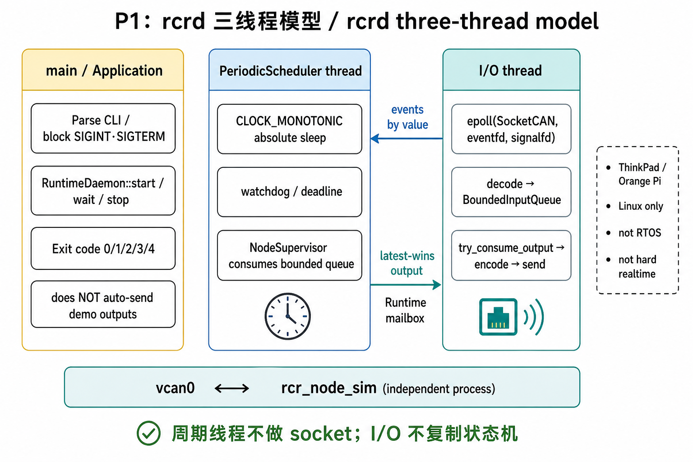
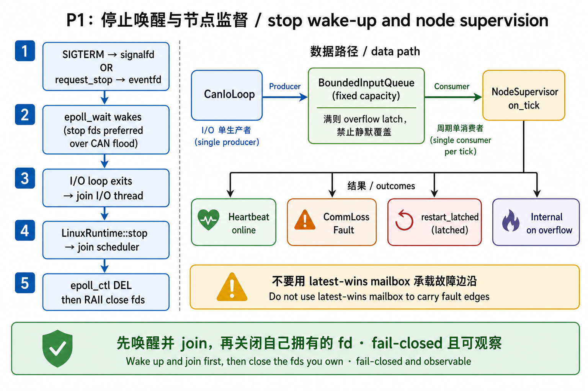
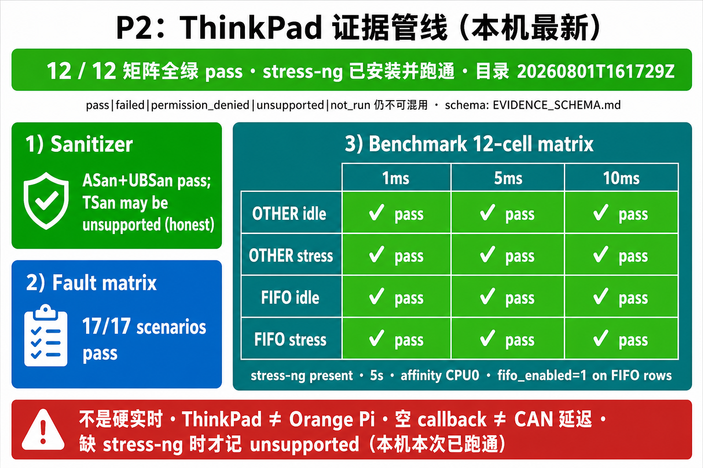

# 系统理解图示

本目录存放帮助建立系统直觉的示意图。它们是教学用图，不是运行时证据，也不能替代
代码、测试或 `evidence/` 下的验收结果。

| 文件 | 阶段 | 看什么 |
|---|---|---|
| [arch-v1-layers.png](arch-v1-layers.png) | 总览 | V1 分层：验收 → Runtime Core → SocketCAN → vcan0 → 节点模拟器 |
| [process-vcan-isolation.png](process-vcan-isolation.png) | 阶段 1 | 两进程只经 `vcan0`，不共享内存 |
| [can-v1-message-flow.png](can-v1-message-flow.png) | 阶段 1 | Heartbeat / Command / OutputStatus 双向流程 |
| [runtime-fail-closed.png](runtime-fail-closed.png) | Core | worker 退出后命令路径 fail-closed |
| [evidence-boundaries.png](evidence-boundaries.png) | 总览 | 已建成 / 能证明 / 不能声称 |
| [epoll-timerfd-shutdown-order.png](epoll-timerfd-shutdown-order.png) | 阶段 1 | `rcr_node_sim`：先从 epoll 摘掉，再关闭业务 fd |
| [rcrd-thread-model.png](rcrd-thread-model.png) | **P1** | `rcrd` 三线程：main / 周期监督 / I/O epoll |
| [rcrd-stop-and-supervision.png](rcrd-stop-and-supervision.png) | **P1** | eventfd·signalfd 停止顺序与有界队列监督 |
| [p2-evidence-pipeline.png](p2-evidence-pipeline.png) | **P2** | sanitizer / 故障矩阵 / 12 组 benchmark；图中旧结果只作流程示例，正式状态以当前证据文件为准 |

## P1 / P2 快速入口

### P1：`rcrd` 怎么跑起来、怎么停

### P2：ThinkPad 证据怎么分层

海报中的「12/12 全绿 / stress 已跑通」是审计前一次历史运行的标注，不代表当前 Gate；
审计修复后必须以干净 commit 新生成的 `SUMMARY.txt` 为准，教学图不能替代原始证据。

对应代码与脚本入口：

- 分层与 Core：`docs/LINUX_RUNTIME.md`、`linux/include/rcr/runtime.hpp`
- P1 daemon：`linux/include/rcr/runtime_daemon.hpp`、`linux/include/rcr/can_io_loop.hpp`、
  `docs/RCRD_CONTRACT.md`
- P2 证据：`docs/EVIDENCE_SCHEMA.md`、`linux/scripts/run_asan_ubsan.sh`、
  `linux/scripts/run_fault_matrix.sh`、`linux/scripts/run_thinkpad_benchmark_matrix.sh`
- 进程验收：`linux/apps/rcr_vcan_acceptance.cpp`、`linux/apps/rcr_node_sim.cpp`
- 关闭顺序：I/O / 模拟器路径中先 `reactor.remove(...)` 再 close
