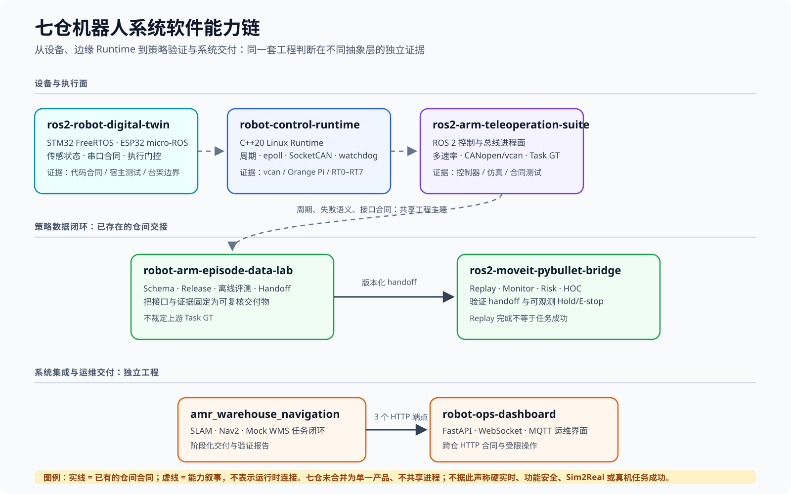
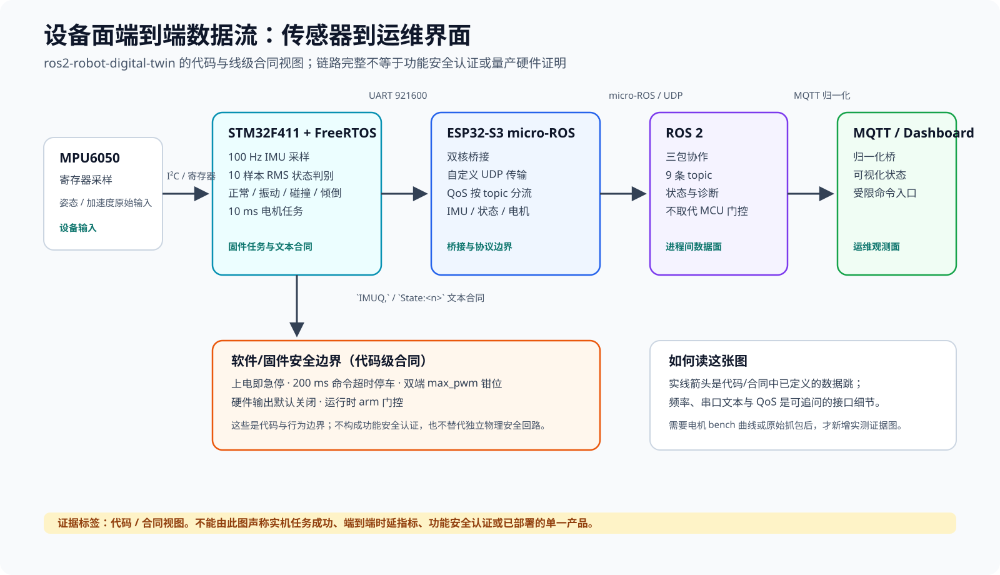

# 我的个人求职叙事(故事版·七仓全链)

> 配套阅读:`SEVEN_REPOS_OVERVIEW.md`(七仓总纲)· `SYSTEMS_SOFTWARE_PORTFOLIO.md`(项目说明书)· `RESUME_AND_TALK_TRACK.md`(简历条与口述稿)· `KNOWLEDGE_BASE.md`(面试深挖)
> 定位:机器人软件工程师——从 MCU 到策略闭环的整条链。底层技术是**展示重点**(面试官普遍关注),不是岗位限定;投不同岗位时只调叙述重心,不改结构。
> 图例约定:【图:名称 | 素材:来源或"待画" | 可选度】——标注在叙事中该图出现的位置;原则:架构图跟结构走,数据流图跟链路走,证据图跟数字表走,一张图一个观点。

---

## 我是谁

自动化背景,转系统软件方向。我用七个相互独立、证据完整的仓库,从 MCU 一路做到策略闭环——**MCU 传感执行面 → 边缘 Linux Runtime → 控制/总线进程面 → 策略数据闭环 → 运维数据平台**。每一层都遵循同一个标准:**可运行、可测量、可复现**。

七仓是并列相关工程，不是已合并部署的单一产品。实线为已有仓间合同；虚线只表示复用的工程判断。

## 我做了什么(成果总览)

| 层 | 仓库 | 交付了什么 |
|---|---|---|
| MCU 传感执行面 | ros2-robot-digital-twin | 打通从 MPU6050 寄存器到 MQTT dashboard 的完整三层链路:STM32 FreeRTOS(100Hz 采样、四态判别、10ms 电机任务)+ ESP32 micro-ROS 桥 + ROS2 三包;9 条 topic + 4 条串口协议全部代码级核实;5 项安全机制(上电即急停/200ms 超时停车/双端钳位/输出默认关/运行时 arm) |
| 边缘 Linux Runtime | robot-control-runtime(主仓) | 约 1.05 万行 C++20 的 ROS-free 运行时:周期调度器、状态机、命令邮箱、watchdog、trace、epoll/SocketCAN、守护进程;CAN V1 协议冻结 + golden vectors;18 个测试目标、19/19 故障矩阵场景、ASan+UBSan 通过 |
| 实时测量 Lab | 主仓(evidence) | RT0–RT7 完整实验链:调度对照、cyclictest 交叉验证、用户态抖动定位、分段时延证明 wakeup≠e2e;双平台 12 格调度矩阵,每份证据带环境全字段 |
| 控制/总线进程面 | ros2-arm-teleoperation-suite | ROS2 Jazzy 16 包架构:MoveIt Servo + 笛卡尔阻抗(500Hz 仿真/1kHz 真机路径)、双轨评测、策略推理编排(legacy/shadow/authoritative)、LeRobot 录制链 |
| 策略数据闭环 | robot-arm-episode-data-lab + ros2-moveit-pybullet-bridge | 打通"采集→适配→质检→release→训练→handoff→回放评测"全链,每环有机器可读产物;Gate 协议字段全链一致;风险监控(分布漂移/安全决策/HOC);97 个面试 FAQ |
| 系统集成 | amr_warehouse_navigation | 四阶段全部落地:SLAM 建图→Nav2 导航→固定任务点→Mock WMS 任务闭环;9 份验证报告;`warehouse.yaml` 与设计文档逐字节一致 |
| 运维数据平台 | robot-ops-dashboard | 独立交付全栈:FastAPI 后端(零 ROS 依赖)+ 纯静态前端 + WebSocket/MQTT;任务下发、状态看板、受限电机命令(硬限幅);与 AMR 仓 3 端点契约一致 |

## 为什么做这些项目

底层系统岗位要的不是"我会用某个框架",而是:周期线程怎么写才不漂移、fd 事件循环为什么用 epoll、调度失败程序怎么办、命令过期要不要重放、跨仓接口怎么保证不出错。**我用七个仓库,把这些问题一个一个做成能运行、能测量、能给别人验证的东西。** 而这些问题之上的完整链路——传感、控制、数据、平台——正是机器人软件工程师的日常。

---

## 故事主线:从传感器到策略闭环

### 序章:先打通一条完整的三层链路(ros2-robot-digital-twin)

起点是 MCU。我在 STM32F411 + FreeRTOS 上实现了传感执行面:100Hz 采样 MPU6050、10 样本 RMS 状态判别(正常/振动/碰撞/倾倒四态)、以 `IMUQ,`/`State:<n>` 文本合同经 921600 串口上行;ESP32-S3 双核跑 micro-ROS 桥(UDP 自定义传输、QoS 按 topic 分流),把 IMU、状态、电机共九条 topic 送进 ROS2,再接 MQTT 归一化桥直达 dashboard。

这是代码/合同视图：标出频率、串口文本与 QoS，不把链路图当作电机台架、端到端时延或功能安全证据。

**这条链是完整打通的**——从传感器寄存器到网页看板,每一跳都有代码和契约可查。同时我在最底层就把安全做满:上电即急停、200ms 命令超时停车、双端 max_pwm 钳位、硬件输出默认关闭 + 运行时 arm 门控,并沉淀了 5 个宿主测试和调参纪律文档。

### 第一幕:实现一个 ROS-free 边缘 Runtime(robot-control-runtime)

MCU 之上是 Linux。我在 `vcan` 上实现了完整的 C++20 Runtime,约 1.05 万行(核心 + 测试):

- `CLOCK_MONOTONIC` 绝对时间周期调度,miss 按跨过的计划边界计数;
- `SCHED_FIFO` 可申请、可观测降级——worker 线程自己设置调度属性和亲和性,通过启动握手回传真实结果;
- `epoll` 统一驱动 SocketCAN / eventfd / signalfd;
- 命令合同:session + 严格递增 sequence + deadline 多点校验,恢复后不自动重放;模拟节点
  Applied 输出受同一 deadline lease 约束,到期归零（vcan 软件证据,非硬件安全）;
- 输入边沿有界队列 + overflow 锁存,普通输出 latest-wins——**故障永远不会被静默覆盖**;
- 守护进程:eventfd/signalfd、有界输入队列、启动失败逆序回收线程。

【图:Runtime 架构分层图 | 素材:已有 evidence/portfolio/figures/02_runtime_layers.png | 推荐】
【图:平台拓扑(ThinkPad/Orange Pi/vcan/部署面)| 素材:已有 01_platform_topology.png | 可选】

**验证做到什么程度**:18 个测试目标(零第三方依赖)、19/19 故障矩阵场景、6 项 vcan 双进程验收、ASan+UBSan 通过、CAN V1 协议冻结并配 golden vectors 逐字节验证。这套"失败语义"是我能当面讲清楚的设计决策表:

| 代码里的决策 | 回答的面试问题 |
|---|---|
| `Result<T>` 显式返回值,`Errc` 只做分支 | 为什么不用异常跨线程边界? |
| `start()` 用条件变量等 worker 完成初始化后才返回成功 | start 返回成功但 worker 已死怎么办? |
| FIFO/affinity 由 worker 自己设置 | 调度属性是谁的? |
| 启动失败逆序回收 | 部分启动失败怎么不留孤儿线程? |
| 故障锁存、普通输出 latest-wins | 为什么故障不能被静默覆盖? |
| TraceBuffer 用 try_lock | 诊断怎么不扰动控制路径? |

### 第二幕:部署到 ARM,并完成系统集成(主仓 + AMR + dashboard)

**部署**:在 Orange Pi 4 Pro 上完成 aarch64 原生构建、release 安装、systemd unit、CPU affinity/governor 控制,并跑出双平台 12 格调度矩阵(OTHER/FIFO × idle/stress × 1/5/10ms)。板上 `rcrd` 常驻因厂商镜像无 CAN 内核未做,如实记录。

**系统集成**:同时期我把"大目标切成可验证阶段"练成了完整交付——AMR 仿真四阶段(SLAM 建图 → Nav2 导航 → 固定任务点 → Mock WMS 任务闭环)全部落地,每个阶段一份验证报告(共 9 份),commit 历史就是一条可追溯的交付时间线;其上接一个全栈运维平台(FastAPI + 纯静态前端 + WebSocket + MQTT,电机命令带硬限幅),与 AMR 仓的 3 个 HTTP 端点契约对齐、状态映射全覆盖。集成中暴露的契约不对称问题(start_zone 前端可选、上游白名单没有)被我写进审计报告并给出修复方案。

【图:AMR 仿真环境/导航可视化 | 素材:已有 artifacts/screenshots/rviz_tf_topic_status.png、gazebo_warehouse_environment.png | 可选】
【图:dashboard 平台界面 | 素材:已有 artifacts/screenshots/dashboard-overview-1440x900.png 等 | 可选(证明交付物,一张即可)】

### 第三幕:Real-time Lab——把「实时」做成可测量的结论(主仓)

我用 RT0–RT7 七组实验,把"实时"拆成能测量的子问题并逐一回答:

- **RT1**:同核 OTHER 压力下 miss≈43,530、p99≈4.0ms;同条件 FIFO miss=0、p99≈9.8µs——量化了调度策略的真实差异(60s smoke,A76/cpu7);
- **RT2**:cyclictest 四代表格交叉验证方向一致(OTHER avg 1.28ms vs FIFO avg 4.6µs);
- **RT3**:定位用户态抖动源——mlock 冷触碰 +4097 minflt→0;无 PI ≈78ms vs PI ≈37ms;
- **RT6**:分段时延证明 **wakeup≠e2e**——baseline p50:e2e≈96µs,其中 wakeup≈60µs、callback≈0.25µs、queue≈34µs、io_ack≈0.4µs,注入 busy 可独立抬高对应段,4/4 pass;
- **RT7**:收口为因果图 + 证据等级表 + 复跑命令,整套 Lab 可复现。

【图:RT1 证据图(OTHER vs FIFO miss/p99 对比)| 素材:已有 03_rt1_other_vs_fifo.png | 推荐,证据图跟数字表放一起】
【图:RT6 证据图(分段时延,标注 wakeup≠e2e)| 素材:已有 04_rt6_segments_p50.png | 推荐】
【图注原则:每张证据图注明环境字段与证据文件来源,不做任何美化】

这些是**结论,不是口号**:调度策略改善多少、抖动来自哪一段、空 callback 能不能代表控制延迟——都变成了带环境字段(内核/governor/affinity/负载/温度)的可复核数据。

### 第三幕续:策略数据闭环——把接口合同做成代码级可校验(三仓)

最后是机器人策略侧。三仓(执行/采集 → 合同/训练/评测 → 回放/风险/监控)构成具身策略数据治理与分层验证框架,**整条链是跑通的**:`run_three_repo_closed_loop.sh` 一键走完 G0–G3,接口字段(`upstream_gate`/`filter_scope`/`must_validate`)从 meta.json 到 benchmark_summary 全链一致——接口规范不是文档,是能挡住错误提交的 Gate。

【图:三仓数据流图(G0–G3 闭环)| 素材:已有 three_repo_canonical_dataflow.svg(上游/下游仓库内)| 推荐】
【图:三仓总览/运行证据 | 素材:已有 readme_three_repo_overview.svg、three_repo_canonical_run_evidence.svg | 可选】

这条链上我做了三个关键工程判断,每一个都留下了可回溯的证据:

1. **隔离错误的评测器**(INVALID_EVALUATOR_V0)——发现评测器自身有错,隔离而不是掩盖;
2. **interface 5/5 ≠ 任务成功**——SmolVLA 接口全通但连续 GT 0/20,主动降级判定,不拿接口通过冒充任务成功;
3. **近黑结果复测证伪**——首轮 reach 3/5,修光复测后权威结果 1/5,首轮数据标注 Superseded,9 份引用文档无一处再把旧结果当权威。

**这条链证明:我不仅能写系统,还能建立"只有证据能说话"的评测与交付体系。**

---

## 故事的高潮:三个关键决定

1. **PREEMPT_RT Gate 判定为 Blocked 时选择不装核**——板上唯一启动镜像、无回退方案,装核实验做了也不可信;把 Gate 依据写成文档;
2. **近黑评测结果主动复测证伪**——数据"看起来不错"时,选择拆穿它;
3. **全部主证据标 dirty/smoke/pilot,写死"不能声称"清单**——拒绝冒充正式基线。

这三个决定不是"没做成",而是**在关键节点上选择做正确的事**,并且每一件都有文档可查。

## 面试问答表

| 面试官问 | 我的故事回答 |
|---|---|
| 你做过什么? | 七仓证据链:MCU 传感执行面 → 边缘 Runtime → 策略数据闭环 → 运维平台,每一层都可运行、可测量、可验证 |
| 你怎么验证? | 18 测试 + 19 故障场景 + 双平台 12 格矩阵 + RT1–RT7 实验链 + 9 份验证报告 + Gate 全链产物 |
| 遇到阻碍怎么办? | 三选一讲:RT4 不装核写 Gate 文档 / 近黑结果复测证伪 / 跨仓契约不对称写审计报告并给方案 |
| 你怎么证明你懂边界? | 能证明/不能证明清单、dirty/clean 分级、每仓 README 显式边界声明 |
| 跨团队/多系统怎么协作? | 接口合同代码级可校验 + 跨仓契约对齐 + 把问题写进审计报告而不是藏起来 |
| 转行为什么可信? | 自动化背景 + 用测量补课:每一层都有代码和实测证据,不拿 demo 充数 |

## 一页边界(参考表,面试被追问时用)

| 能证明 | 不能证明 |
|---|---|
| 周期线程、绝对睡眠、FIFO 可降级在代码与测试中存在 | 硬实时 / WCET 保证 |
| OTHER vs FIFO 方向性差异(Orange Pi,dirty smoke) | 干净 commit 正式基线 |
| epoll + SocketCAN 在 vcan 路径上的功能验证 | 板上 rcrd 常驻与物理 CAN |
| 用户态 mlock/PI/分配对抖动的影响(夹具) | PREEMPT_RT 对照收益(RT4 Gate Blocked) |
| 状态机 Hold/EStop 行为、MCU 层急停链(代码级) | 功能安全认证、真机硬件验证结论 |
| Gate 协议字段全链一致、S4 权威证据(lift 0/5 Hold) | 任务成功 / Sim2Real / 真机部署 |
| 三仓接口合同、跨仓 HTTP 契约对齐 | 云端推理链路 / PTP 硬件时间同步 / fleet 级运维(明确缺口) |

## 下一步(本版之后)

1. 按发布计划关 clean Gate:干净 commit 复跑,数字升级正式基线;
2. 按缺口清单补证据:遥操作数采平台统合层、PTP 最小实验、断点续传工具(收益排序见 `~/resume-portfolio/roles/robot_software_infra_engineer.md` §8);
3. 作品集按 `~/resume-portfolio/03_portfolio_blueprint.md` 落成 7 页;图位按本文【图】标注执行:架构图跟结构、数据流图跟链路、证据图跟数字表,优先用已有 SVG/PNG,不新画非必要图。
