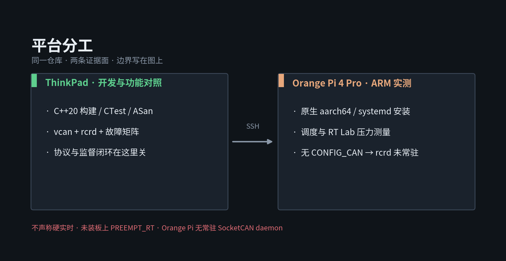
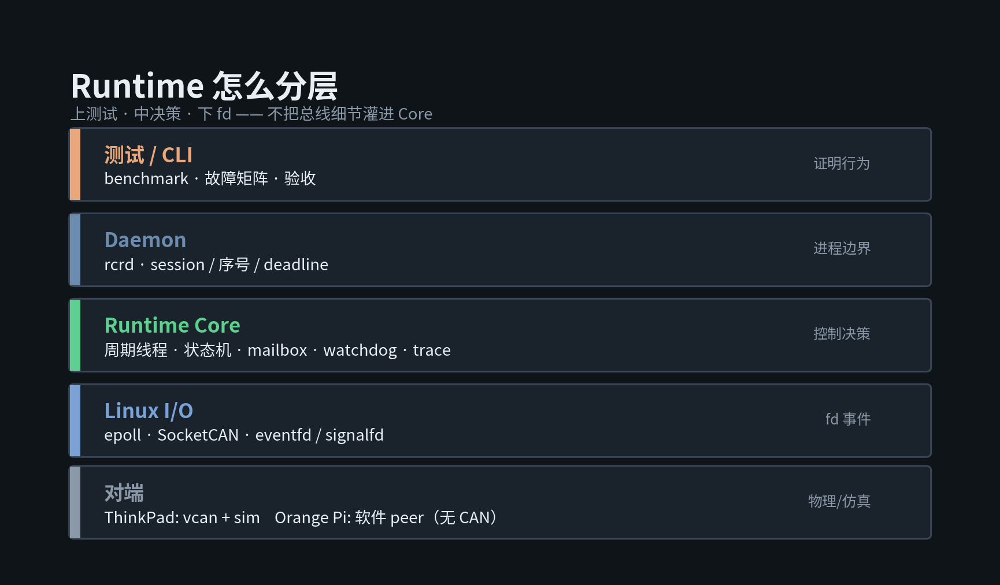
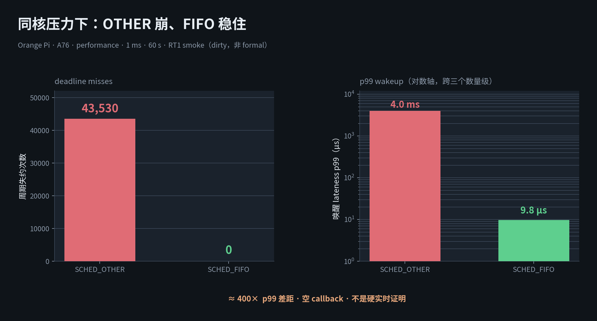
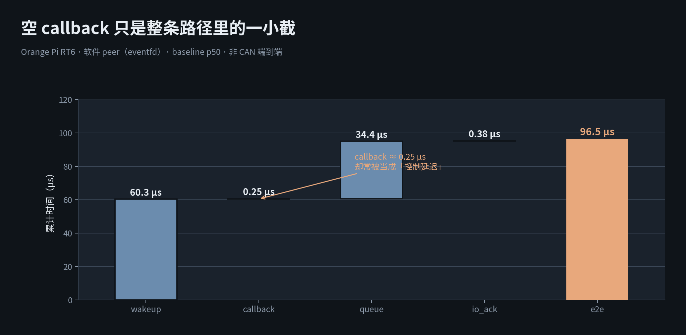

# 机器人边缘底层 Runtime：调度、I/O 与可观测失败

> C++20 · Linux · SocketCAN · Orange Pi · 独立项目  
> 投递方向：机器人系统软件 / 底层系统软件 / 嵌入式 Linux / 通信中间件 / C++ Runtime

自动化转行后，我把作品集主线收成一件事：**在真实 ARM Linux 上，把周期线程、调度策略、fd 事件循环和协议合同做成可测量、可降级、可讲清边界的 Runtime**——而不是再堆一层应用 Demo。



---

## 30 秒看懂

我实现的是 **ROS-free** 的 Linux 边缘 Runtime（`rcr` / `rcrd`）：

- 用 `CLOCK_MONOTONIC` + 绝对时间睡眠做周期监督，避免相对睡眠累计漂移；
- 可选 `SCHED_FIFO`，申请失败时**显式记录并降级**，不静默假装实时；
- 用 `epoll` 统一等待 SocketCAN / eventfd / signalfd，I/O 线程不空转；
- 普通输出走 latest-wins mailbox，命令带 **session / 严格递增 sequence / deadline**；
- 在 ThinkPad `vcan` 上验功能与故障矩阵；在 **Orange Pi 4 Pro** 上验原生构建、systemd 安装合同和调度压力对照。

当前厂商镜像 `# CONFIG_CAN is not set`，因此板上**没有** `vcan`/`rcrd` 常驻——安装合同 ≠ daemon 已绿灯。公开调度证据多为 dirty experiment/smoke，正式 clean Gate 仍按发布计划关闭。

---

## 我做了什么

**把“想实时”拆成可观测合同。**  
周期、亲和性、governor、FIFO/OTHER、同核/异核压力都进测量矩阵；空 callback 的 wakeup lateness 只回答调度唤醒，不冒充 CAN 端到端。

**让失败语义可见。**  
FIFO 申请失败保留 `fifo_error`；命令过期不自动重放；故障经单锁升级路径进入 Hold / 软件 EStop（软件行为演示，不是功能安全）。

**用对照实验讲调度，而不是背名词。**  
同一 A76 核、performance governor、同核 stress：OTHER 出现大量 deadline miss，FIFO 同窗 miss 降到 0（RT1 smoke）。再用 cyclictest 同条件对照，确认方向不是本仓空 callback 独有（RT2）。

**分清用户态自己制造的抖动。**  
RT3 夹具覆盖 mlock、PI mutex、周期内分配 vs 预分配；说明硬实时不是“开 FIFO 就结束”。

**诚实停在 PREEMPT_RT 门外。**  
RT4 Gate = Blocked（缺可追溯源码闭环与双启动回退），板上未装 RT 核，因此**不能**回答“RT 核改善了多少”。



---

## 系统怎么分层

```text
CLI / Test / rcrd
        ↓
Application / Supervision
        ↓
Runtime Core
  PeriodicScheduler · StateMachine · CommandMailbox
  MonotonicWatchdog · TraceBuffer
        ↓
EpollReactor + SocketCAN（有真实 fd 才进 Runtime 线程）
        ↓
vcan0（ThinkPad） / 板上当前无 CAN
```

设计约束（面试常问“为什么不……”）：

| 选择 | 不选 | 原因 |
|---|---|---|
| 先做 SocketCAN | 通用 Transport 抽象 | 只有一个真实 fd 数据流时，抽象没有第二实现 |
| latest-wins mailbox | 无界队列堆命令 | 普通设定点可覆盖；故障/边沿不得静默覆盖 |
| 绝对睡眠 | 只 sleep(period) | 消除累计漂移；仍不消除调度 jitter |
| FIFO 可降级 | 启动失败就崩溃或假装成功 | 权限/内核能力不足时行为必须可观测 |
| 软件 EStop | 宣称安全认证 | 无物理安全回路时禁止功能安全话术 |

原理展开：[LINUX_RUNTIME.md](../LINUX_RUNTIME.md) · 模块卡：[MODULE_KNOWLEDGE_CARDS.md](../MODULE_KNOWLEDGE_CARDS.md)

---

## 关键证据（可对外引用）

### 1) OTHER vs FIFO（主案例）



代表数字（RT1 60s smoke，空 callback，A76/`cpu7`/performance，**dirty smoke**）：

| 条件 | misses | 读法 |
|---|---:|---|
| OTHER + 同核 stress | ~43530 | 同核普通任务争用会打穿周期 |
| FIFO + 同核 stress | 0 | 同窗 FIFO 显著改善 miss |
| FIFO idle | 0 | 机制生效，不是偶然一格 |

摘要：[orangepi_rt1_smoke_20260805.md](../../evidence/portfolio/orangepi_rt1_smoke_20260805.md)

### 2) 分段时延（软件 peer）



说明：软件 peer 分段，**不是** CAN 端到端；用来回答“延迟预算该切在哪一段”。  
摘要：[orangepi_rt6_segmented_20260805.md](../../evidence/portfolio/orangepi_rt6_segmented_20260805.md)

### 3) 平台与部署

- Orange Pi：SSH、aarch64 原生构建、release/systemd 安装合同、调度矩阵  
- 阻塞：厂商内核无 SocketCAN → `rcrd` 未在板上 active  
- Modbus TCP：有 Wi-Fi 双机 demo，**不是**现场仪表 / Runtime 集成证据

收口总表：[orangepi_rt7_wrapup_20260805.md](../../evidence/portfolio/orangepi_rt7_wrapup_20260805.md)

---

## 同一套能力，落在三层链路上

本仓刻意 **ROS-free**，深挖边缘 Linux。它不是和其他仓「附带相关」，而是和臂控制栈、MCU 链路一起，构成**自底向上的系统软件证据链**：

```text
策略 / 应用意图（其他仓，本版可不展开）
        ↓
控制与总线进程面 ── ros2-arm-teleoperation-suite
  多速率环 · 仿真关 FIFO · CANopen/vcan · ros2_control
        ↓  （未来 intent/status 合同；当前未并成单一进程）
边缘 Linux Runtime ── 本仓 robot-control-runtime
  周期监督 · FIFO 可降级 · epoll · SocketCAN · session/deadline
        ↕  （经验不同：本仓不重复 PID / FreeRTOS 电机主链）
MCU 传感执行面 ── robot-state-monitor-v1
  STM32 状态判别 · ESP32 micro-ROS 桥 · N20 速度环 bench
```

| 层次 | 你要讲的系统问题 | 证据落点 |
|---|---|---|
| 边缘 Runtime | CPU 调度、fd I/O、命令时效、部署合同 | 本仓 RT1/RT2/RT3 + figures |
| 控制 / 总线 | 多进程优先级、DDS 与 FIFO 取舍、DS402 状态机 | 上游 launch / 控制器 / vcan |
| MCU | 任务周期、串口合同、闭环 bench | twin 固件与 ROS 桥 |

对外口径：

- **是**：同一求职叙事下的三层相关工程，证明你会在用户态 Runtime、ROS 控制面、MCU 面各自做对的事。  
- **不是**：已经合并部署的单体产品；也不是本仓「附赠项目」。  
- 面试顺序建议：先讲本仓测量（OTHER/FIFO），再上接到控制面「为什么仿真要关 FIFO」，再下接到 MCU「周期与合同在单片机上长什么样」。

七仓边界（防重复建设）：[SISTER_REPOS.md](../SISTER_REPOS.md)

---

## 能证明 / 不能证明

| 能证明 | 不能证明 |
|---|---|
| 周期线程、绝对睡眠、FIFO 可观测降级在代码与测试中存在 | 硬实时 / WCET 保证 |
| Orange Pi 上 OTHER vs FIFO、同核压力的方向性差异 | 干净 commit 正式基线（发布 Gate 未全部关） |
| epoll + SocketCAN 在 ThinkPad vcan 路径上的功能设计 | 板上 `rcrd` 常驻与物理 CAN |
| 用户态 mlock/PI/分配路径对抖动的影响（夹具） | 板上 PREEMPT_RT 对照收益 |
| 软件状态机 Hold / EStop 行为 | 功能安全认证、物理急停闭环 |

---

## 面试官若只问操作系统

请直接使用知识库口述结构（问题 → 方案 → 内核做什么 → 失败表现 → 证据）：

- 用户态/内核态与 fd：[KNOWLEDGE_BASE.md §3](../KNOWLEDGE_BASE.md)
- 时间与调度、FIFO、PREEMPT_RT 边界：[KNOWLEDGE_BASE.md §5](../KNOWLEDGE_BASE.md)
- 下游对照笔记（进程/DDS/甘特）：姊妹仓 `ros2-moveit-pybullet-bridge/docs/portfolio/RUNTIME_KERNEL_PROCESS_COMM_LEARNING.md`

---

## 下一步（本版之后）

1. 按 [PORTFOLIO_V1_RELEASE_PLAN.md](../PORTFOLIO_V1_RELEASE_PLAN.md) 关 clean Gate，替换 dirty 数字为正式基线。  
2. 「三层链路」已纳入 [七仓能力链总图](assets/seven_repo_capability_chain.svg)：虚线明确表示共享工程主题，而非未实现的部署合同。  
3. 电机 bench 曲线与原始串口抓包等待 twin 仓可追溯台架/日志后再补；不能用示意图代替实测。  
4. 投嵌入式偏 MCU 的 JD 时，项目三写满；投中间件/Runtime 时项目一加长、项目三收成四行。
