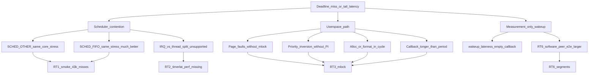

# RT7：Real-time Linux Lab 收口（2026-08-05）

状态：**已关闭（文档收口）**  
主平台：Orange Pi 4 Pro（`6.6.98-sun60iw2`，普通 `CONFIG_PREEMPT=y`）  
分类：全部主证据均为 `git_dirty=true` 的 experiment/smoke/pilot，**不是** clean formal 基线。

本文件是作品集级摘要：回答「学到了什么、测到了什么、没做成什么、面试怎么说」。
不替代各阶段原始证据目录。

---

## 1. 一句话结论

在 Orange Pi 上建立了可复现的**普通内核**实时测量管线：能区分 OTHER vs FIFO、同核压力、
用户态缺页/PI/周期路径，以及软件 peer 分段时延；**未能**做板上 PREEMPT_RT 同条件对照
（RT4 Gate = Blocked）。因此不得声称硬实时，也不得声称“已对比 RT 内核收益”。

### 推荐作品集表述（已按证据改写）

> 在 Orange Pi 4 Pro 上建立 Real-time Linux 实验环境：用同一套周期测量合同
> （`rcr_benchmark` / cyclictest / 用户态夹具 / 分段时延）在普通内核上量化
> CPU affinity、DVFS、同核 `SCHED_OTHER` 压力与用户态抖动源；PREEMPT_RT 因缺少
> 可追溯源码闭环与双启动回退（Gate Blocked）未安装。保留环境元数据、失败边界与
> “不能声称”清单。

（计划原稿中的“对比普通内核与 PREEMPT_RT”**尚未发生**；面试勿背原稿。）

---

## 2. 普通内核 vs PREEMPT_RT 对照摘要

| 项 | 状态 |
|---|---|
| 普通内核基线（RT0–RT3、RT6） | **有**（dirty experiment/smoke） |
| 板上 PREEMPT_RT 安装 | **无**（禁止） |
| 同条件 RT 对照（RT5） | **未开始** |
| ThinkPad Fallback 方法对照 | **允许但未作为本收口主证据** |

Gate 依据见 [`docs/PREEMPT_RT_FEASIBILITY_GATE.md`](../../docs/PREEMPT_RT_FEASIBILITY_GATE.md)：
唯一 `uImage`、boot/root 同分区、源码↔hash 未闭环、RT 补丁兼容性未知。

**诚实填空**：改善来自哪里 / 哪些没改善 / 代价 / 是否采用 → **无法回答**，因缺少 RT 核变量。

---

## 3. 延迟来源因果图（普通内核，已观测）

读图要点：

1. **同核 OTHER 压力**是当前最强、可重复的调度侧恶化源（RT1 + RT2 一致）。  
2. **FIFO** 在同条件冒烟窗显著改善 miss，仍不是硬实时证明。  
3. **IRQ 精确占比**未关闭（缺 `timerlat`/`osnoise`/`perf` 匹配）。  
4. **用户态**可独立制造抖动（缺页、无 PI、周期内分配、过载）。  
5. **空 callback wakeup ≠ 路径延迟**（RT6：e2e ≫ callback）。

---

## 4. 阶段证据索引与复跑

| 阶段 | 作品集摘要 | 原始目录（本地/板） | 复跑入口 |
|---|---|---|---|
| RT0 | [`orangepi_scheduler_20260805.txt`](orangepi_scheduler_20260805.txt) pilot | B3 / schema | 见 schema |
| RT1 | [`orangepi_rt1_smoke_20260805.md`](orangepi_rt1_smoke_20260805.md) | `…T103150Z_orangepi_rt1_smoke` | `deploy/orangepi/rt1_smoke_once.sh` |
| RT2 | [`orangepi_rt2_cyclictest_20260805.md`](orangepi_rt2_cyclictest_20260805.md) | `…T111247Z_orangepi_rt2_cyclictest` | `deploy/orangepi/rt2_cyclictest_once.sh` |
| RT3 | [`orangepi_rt3_userspace_20260805.md`](orangepi_rt3_userspace_20260805.md) | `…T113406Z_rt3_userspace` | `experiments/realtime_userspace/scripts/rt3_orangepi_once.sh` |
| RT4 | [`orangepi_rt4_gate_20260805.md`](orangepi_rt4_gate_20260805.md) | `…T113914Z_orangepi_rt4_gate` | 只读探针；见 Gate 文档 |
| RT5 | — | — | **禁止**直至 Gate Pass |
| RT6 | [`orangepi_rt6_segmented_20260805.md`](orangepi_rt6_segmented_20260805.md) | `…T115347Z_rt6_segmented` | `experiments/realtime_segmented/scripts/rt6_orangepi_once.sh` |

环境字段合同：`docs/REALTIME_EVIDENCE_SCHEMA.md`（kernel、governor、affinity、load、period、duration、git dirty、classification）。

大样本与主机地址默认不入库；仓库保留脱敏摘要 + 脚本 + hash。

---

## 5. 证据等级：理解过 / 代码中使用过 / Orange Pi 实测过

| 主题 | 理解过 | 代码中使用过 | Orange Pi 实测过 |
|---|---|---|---|
| `CLOCK_MONOTONIC` 绝对睡眠 | ✓ | ✓ `PeriodicScheduler` | ✓ |
| `SCHED_FIFO` + affinity | ✓ | ✓ | ✓ RT1 smoke |
| 同核 vs 异核 stress | ✓ | ✓ runner | ✓ RT1/RT2 |
| cyclictest 基线 | ✓ | wrapper | ✓ RT2 |
| IRQ/timerlat 分解 | ✓ 概念 | — | **unsupported** |
| mlock / 缺页 | ✓ | ✓ RT3 夹具 | ✓ |
| PI mutex | ✓ | ✓ RT3 | ✓ |
| 周期内分配/过载 | ✓ | ✓ RT3 | ✓ |
| 分段时延（软件 peer） | ✓ | ✓ RT6 | ✓ |
| PREEMPT_RT 原理 | ✓ §5.4 | — | **未装核** |
| PREEMPT_RT 同条件收益 | ✓ 方法 | — | **无** |
| SocketCAN 路径时延 | ✓ | Runtime 有 | **板上无 CONFIG_CAN** |
| 硬实时 / WCET 证明 | ✓ 边界 | 练习符号 | **未宣称** |

---

## 6. 负面结果与未采用的优化

| 结果 / 选项 | 处置 | 原因 |
|---|---|---|
| 板上装 PREEMPT_RT | **未采用** | RT4 Blocked：无双启动、源码未闭环 |
| 把 pilot 5s Debug 当 formal | **拒绝** | RT0 重分类；禁止混算提升 % |
| timerlat/osnoise/perf 编造 IRQ% | **拒绝** | 工具 unsupported；保留“未知” |
| mlock/PI/预分配默认并入 Runtime | **未采用** | 无 clean formal 收益证明；实验可删 |
| RT6 戳点并入 `rcrd` | **未采用** | 软件 peer ≠ 生产 CAN 路径 |
| 用空 callback p99 当控制延迟 | **纠正** | RT6 显示 e2e 更大 |
| 声称硬实时 / 功能安全 | **禁止** | 无 WCET 证明、无安全回路 |
| 高温下硬拼 formal | **停止规则** | RT1 smoke 升至 ~88°C |

---

## 7. 与 V1 Runtime 的关系

- Real-time Lab **并行**于 V1；V1 不依赖 PREEMPT_RT。  
- Lab 夹具默认在 `experiments/`，不改变 `rcrd` 生命周期合同。  
- 若将来 Gate Pass 且 RT5 显示可重复收益，再评审是否把个别机制（如可选 mlock）进主线——**当前没有该提案**。

---

## 8. 收口后下一步（非 RT7 范围）

1. 用户说「提交」→ 入库 RT0–RT7 文档/脚本；板上 clean checkout。  
2. 可选 RT1 30min formal（盯温度）。  
3. 不要做 RT5，直到 Gate 重开 Pass。  
4. V1 作品集 clean Release 证据与 Lab 分开叙述。
